# PSO v4.0.0 실증 벤치마크 평가 보고서 (Benchmark 2.0.0 + Tuning 1.0.0 + Replication 1.0.0 + Epoch Convergence 1.0.0 + Full MNIST 1.0.0 + Deep Accuracy 1.0.0 + MNIST-PSO-RAW-V5 1.0.0 + MNIST-PSO-RAW-V6 1.0.0 + HEAVY-TASK-PSO-V6 1.0.0 + HEAVY-PSO-CROSS-SPLIT 1.0.0)

## 1. 요약 및 핵심 발견사항 (Executive Findings)

본 보고서는 `pso2keras` 라이브러리의 v4.0.0 5단계 플러그인 아키텍처 기반 미분 무관(Derivative-Free) Particle Swarm Optimization (PSO) 알고리즘 수렴 성능 및 특성에 대한 종합 실증 평가 결과입니다. 벤치마크 프로토콜 v2.0.0에 따라 총 225회의 독립 측정 실행(메인 벤치마크 7기법 × 5워크로드 × 5시드 = 175회, MNIST Ablation 10프로필 × 5시드 = 50회)을 수행하였으며, 모든 실행은 에러 없이 100% 성공적으로 완료되었습니다.

추가로 Tuning Protocol 1.0.0에서 32개 하이퍼파라미터 후보의 검증 선택, 5개 기법의 held-out 확인, `adaptive_moment` 파티클 스케일링을 수행했습니다. 이 확장 연구는 161개 결과 레코드(96 search + 25 confirmation + 40 scaling)를 포함하며, 공유 30×80 scaling 셀을 재사용했으므로 실제 scaling 적합 실행은 35회입니다. 이후 120×80 exact replay/fresh-seed 10회, 같은 시드 5개의 240-epoch subset 궤적, 공식 MNIST 60,000/10,000 전체 split의 240-epoch 궤적 5회를 각각 별도 프로토콜로 실행했습니다. Deep Accuracy Protocol 1.0.0은 아키텍처 레인 9개와 최적화기 레인 9개의 논리 레코드를 포함하며, 최적화기 레인의 `adam_only` 3개는 아키텍처 레인의 Compact CNN 결과를 명시적으로 재사용하므로 실제 고유 학습 워크플로는 15개입니다. 이 후속 실행들은 기존 161개 Tuning Protocol 레코드나 225회 Protocol 2.0.0 결과에 합산하지 않습니다.

HEAVY-TASK-PSO-V6 1.0.0은 공식 test split을 사용하지 않고 MNIST/FashionMNIST의 train 60,000개를 각각 search 50,000/validation 10,000으로 분할해, Compact CNN(9,098 params)과 WideCNN(55,338 params)의 전가중치 PSO 실행 가능성을 추가로 평가했습니다. 단일시드 16-cell screen 뒤 G8과 workload별 validation-selected normalized 방법을 3개 시드로 확인했으며, 이 결과는 기존 프로토콜 실행 수에 합산하지 않습니다.

### 핵심 평가 요약
1. **고전 무브먼트 기법의 강세**: 5개 워크로드 종합 평균 순위에서 `constriction` (수축 계수 PSO)과 `inertia` (관성 가중치 감쇄 PSO)가 평가 정확도 평균 순위 **1.60**으로 공동 1위를 기록했습니다. 손실(Loss) 측면에서는 `constriction`이 평균 순위 **1.60**으로 `inertia` (**1.80**) 대비 더 낮은 손실 수렴 성향을 나타냈습니다.
2. **미분 기반 후처리(Adam)의 효과**: MNIST 소형 분류 모델 실험에서 하이브리드 경사하강 미세조정(`tuned_adam_100_lr.01`)을 적용할 경우 검증 정확도 **85.58% ± 0.24%**를 기록하여 최고 성과를 달성했습니다. 다만, 이는 역전파 경사도(`loss.backward()`)를 활용하는 하이브리드 방식입니다.
3. **미분 무관 Ablation 탐색 최고 성과**: pure derivative-free 기법 중 MNIST Ablation 최고 검증 정확도는 `adaptive_moment_.10` (적응형 경로 모멘트 혼합비 0.10)로 **63.00% ± 1.83%**를 기록했습니다 (단, 검증 손실은 **1.243339**로 `inertia_tuned`의 **1.236600** 대비 약간 높음).
4. **평가 방식 및 샘플 수 교란 요인**: 미분 무관 ablation 중 최저 검증 손실은 `tuned_full_evaluation`의 **1.179009 ± 0.050059**였으나, 이는 고정 서브셋(2,000개)이 아닌 전체 학습 데이터(3,000개) 평가 및 배치 처리 차이에 따른 교란 요인(Confound)이 반영된 수치입니다.
5. **파티클 재초기화(Particle Reset)**: `tuned_particle_reset` 프로필은 측정된 시드 세트(46~50)에서 `inertia_tuned`와 동일한 최종 성능 수치(**61.62% / 1.236600**)를 기록했습니다. 재초기화 이벤트 수를 별도로 계측하지 않았으므로, 이벤트가 없었는지 또는 최종 전역 최적해에 영향을 주지 않았는지는 이 결과만으로 구분할 수 없습니다.
6. **확장 튜닝의 동일 예산 확인**: 파티클 30개 × 80세대 held-out 확인에서 `local_best`가 **62.64% ± 2.94%**, `inertia`가 **62.30% ± 3.01%**, `adaptive_moment`가 **61.06% ± 0.91%**를 기록했습니다. 따라서 Adaptive Moment는 이 동일 예산 비교의 최상위 기법이 아닙니다.
7. **Adaptive Moment 파티클 증가**: 80세대를 유지하면서 파티클을 30개에서 120개로 늘리면 정확도가 **62.12%에서 72.34%**로 상승했지만 particle-evaluations와 fit 시간도 각각 4배와 **4.16배**로 증가했습니다. 약 2,400 particle-epochs를 고정하면 파티클 증가와 세대 감소 조합의 정확도는 오히려 낮아졌습니다.
8. **120×80 재현성 확인**: 동일 시드 71~75 exact replay는 baseline과 같은 **72.34% ± 1.82%**를 재현했고 시드별 최대 차이는 **0.00%p**였습니다. 독립 시드 81~85는 **73.60% ± 1.66%**로 baseline 대비 **+1.26%p**였으며, 사전 선언한 ±3%p 및 95% t-신뢰구간 중첩 조건을 모두 충족했습니다.
9. **Epoch 80은 조기 수렴 지점이 아님**: 120개 파티클의 연속 실행을 240세대까지 늘리자 테스트 정확도가 **72.34%에서 83.52%**로 **+11.18%p** 상승하고 training best loss가 **47.30%** 감소했습니다. 200→240에서도 loss가 **6.68%** 감소하고 정확도가 **+0.94%p** 상승해 epoch 240에서도 완전한 plateau는 확인되지 않았습니다.
10. **전체 MNIST 학습 결과**: 공식 train 60,000개를 모든 파티클의 매 epoch fitness에 사용하고 test 10,000개 전체를 평가했습니다. 120 particles × 240 epochs에서 정확도는 **87.70% ± 0.36%**, 테스트 loss는 **0.412078 ± 0.006848**이었습니다. Epoch 200→240에서도 정확도가 **+0.85%p**, training loss가 **6.13%** 개선되어 plateau는 확인되지 않았습니다.
11. **원본 MNIST 이미지 및 딥 신경망 아키텍처/최적화 기법 평가 (Deep Accuracy 1.0.0)**: PCA 없이 공식 train 60,000개와 test 10,000개 원본 $1 \times 28 \times 28$ 입력을 평가했습니다($n=3$, seeds 101~103). Adam 10 epochs에서 Raw Linear(7,850 params)는 **92.45% ± 0.10%**, Raw MLP(109,386 params)는 **97.70% ± 0.08%**, Compact CNN(9,098 params)은 **98.53% ± 0.16%**였고 CNN은 모든 시드가 5 epochs 이내 98%에 도달했습니다. 같은 CNN에서 30 particles × 40 generations·fixed-2k all-weight PSO는 **36.76% ± 3.76%**, PSO→Adam은 **97.30% ± 0.75%**였습니다. 측정한 예산에서는 전가중치 PSO와 PSO 초기화가 pure Adam을 대체하거나 개선하지 못했습니다.
12. **V5 탐색 구조 회귀 원인 분리 (MNIST-PSO-RAW-V6 1.0.0)**: 공식 test split을 로드하지 않고 train 60,000개를 search 50,000/validation 10,000으로 나눈 뒤, Compact CNN 전가중치 PSO의 탐색 구조 9개를 비교했습니다. 3-시드 확인에서 V5 구조 G0은 **79.53% ± 0.58% / NLL 0.689687**, 기존 `Optimizer` 제어군 G8은 **84.92% ± 0.99% / 0.481440**이었습니다. mutation·초기 속도·normalized ±6 경계를 묶은 G5/G6은 각각 **84.24% / 0.510297**, **84.25% / 0.503809**로 사전 회복 기준을 충족했습니다. 단일시드 screen은 mutation과 경계 확장을 유력 요인으로 지목하지만 개별 3-시드 인과 확인은 아직 수행하지 않았습니다.
13. **더 무거운 영상 태스크 실행 가능성 (HEAVY-TASK-PSO-V6 1.0.0)**: 파라미터 수를 **9,098→55,338(6.08배)**로 늘리고 FashionMNIST를 추가한 네 workload에서 G8과 screen-selected G5/G6의 24개 확인 실행이 모두 finite하게 완료됐습니다. 사전 기준(초기 모델 대비 validation NLL 20% 이상 감소와 accuracy 20%p 이상 상승)은 8개 workload-method 집계가 모두 통과했습니다. 그러나 12 particles × 80 epochs·fixed-10k에서 최종 정확도는 **41.03~49.15%**에 그쳐, 이는 계산상 최적화 가능성이지 실용적 학습 성능이나 Adam 대체 가능성을 의미하지 않습니다.
14. **Heavy PSO 교차 분할 강건성 검증 실패 (HEAVY-PSO-CROSS-SPLIT 1.0.0)**: 개발 분할 2개(20260905/20260906) 및 시드 101~103, 매칭 baseline 재실행 조건(12p×80e×fixed10k)에서 동결 정책 `fixed_global_hybrid_v3`를 교차 평가한 결과, 전체 정확도 개선은 +0.1533%p, NLL 감소는 0.5546%에 그쳤고 최악 accuracy 회귀 -7.1767%p, 최악 NLL 회귀 +14.5682%, MNIST Wide acc -0.3617%p(NLL 2.4600% 악화)로 게이트를 통과하지 못해 실패(FAIL)로 판정되었습니다. 총 8회 결정 탐색(9개 개발 변형) 중 최상위 스코어 후보(Iteration 5, 스코어 -185.610686)도 MNIST Wide acc -2.6633%p(NLL 2.1874% 악화)로 탈락했습니다. 이에 따라 보존 정책은 `null`로 확정되었고 확인 분할(20260907) 실행은 과학적 규칙에 따라 보류되었으며 공식 test split은 0회 로드/평가되었습니다 (총 432 runs, 414,720 queries, 41.472억 샘플 평가, 3162.9717s).

---

## 2. 실험 환경 및 워크로드 스펙 (Hardware, Software & Workload Spec)

### 2.1 하드웨어 및 소프트웨어 프로비넌스

| 환경 항목 | 세부 사양 / 버전 |
| --- | --- |
| **플랫폼 (OS)** | macOS 26.5.2 (Darwin 25.5.0 arm64) |
| **프로세서 (CPU/GPU)** | Apple M5 Max (System Apple Silicon, MPS 가속) |
| **Python 버전** | 3.11.15 |
| **PyTorch 버전** | 2.13.0 (`device="mps"`) |
| **패키지 버전** | `pso2keras` v4.0.0 |
| **벤치마크 프로토콜** | Protocol v2.0.0 |

### 2.2 워크로드 및 신경망 모델 매트릭스

본 벤치마크는 비선형 논리 회로(XOR), 소형 다변량 표형 데이터(Iris, Seeds), 중형 이미지 수치 데이터(Digits), PCA 32차원 축소 MNIST 데이터셋을 대상으로 수행되었습니다.

| 워크로드 | 데이터 크기 (학습/검증) | 모델 구조 | 파라미터 수 | 손실 함수 및 작업 | 파티클 수 ($N$) | 세대 수 ($T$) | 평가 대상 집합 | 시드 범위 |
| --- | --- | --- | --- | --- | --- | --- | --- | --- |
| **XOR** | 4 / 4 | `Linear(2,4) - Tanh - Linear(4,1)` | 17 | `BCEWithLogitsLoss` (Binary) | 24 | 80 | Train Eval | 41 ~ 45 |
| **Iris** | 120 / 30 | `Linear(4,10) - ReLU - Linear(10,10) - ReLU - Linear(10,3)` | 193 | `CrossEntropyLoss` (Multiclass) | 24 | 60 | Held-out Eval | 41 ~ 45 |
| **Seeds** | 168 / 42 | `Linear(7,16) - ReLU - Linear(16,32) - ReLU - Linear(32,3)` | 771 | `CrossEntropyLoss` (Multiclass) | 24 | 60 | Held-out Eval | 41 ~ 45 |
| **Digits** | 1,437 / 360 | `Linear(64,12) - ReLU - Linear(12,10) - ReLU - Linear(10,10)` | 1,020 | `CrossEntropyLoss` (Multiclass) | 24 | 50 | Held-out Eval | 41 ~ 45 |
| **MNIST** | 3,000 / 1,000 (PCA32) | `Linear(32,10)` | 330 | `CrossEntropyLoss` (Multiclass) | 30 | 80 | Held-out Eval | 41 ~ 45 |

> **참고**: MNIST 실험은 784차원 원본 이미지 텐서가 아닌 PCA 32차원 로짓 분류기 `Linear(32,10)` 환경(학습 3,000개, 검증 1,000개)에서 수행되었습니다.
> **타이밍 예산 및 웜업**: 각 측정은 별도의 모델과 Optimizer로 기법별 비측정 웜업(PSO 2세대)을 수행한 뒤, 동일 시드로 측정 대상을 다시 생성하여 `fit()` 호출만 측정했습니다. Adam 프로필의 웜업은 refinement 1세대를 포함하며, 메인 미분 무관 실험의 웜업은 refinement를 사용하지 않습니다.

---

## 3. 메인 벤치마크 평가 결과 (Main Benchmark Matrix)

7가지 주요 PSO 무브먼트 기법(`original`, `inertia`, `constriction`, `fips`, `clpso`, `bare_bones`, `adaptive_moment`)에 대한 5개 워크로드별 5-시드 평균 및 표준편차(Mean ± SD, $n=5$) 결과입니다.

### 3.1 정확도 Matrix (Eval Accuracy %, Mean ± SD)

| 워크로드 (평가 구분) | original | inertia | constriction | fips | clpso | bare_bones | adaptive_moment |
| --- | --- | --- | --- | --- | --- | --- | --- |
| **XOR** (Train) | 100.00% ± 0.00% | 100.00% ± 0.00% | **100.00% ± 0.00%** | 75.00% ± 25.00% | 60.00% ± 13.69% | 100.00% ± 0.00% | 100.00% ± 0.00% |
| **Iris** (Held-out) | 92.00% ± 8.69% | **94.00% ± 2.79%** | 94.00% ± 3.65% | 74.00% ± 5.48% | 79.33% ± 7.60% | 84.67% ± 5.58% | 84.67% ± 7.67% |
| **Seeds** (Held-out) | 87.62% ± 4.26% | **91.43% ± 5.22%** | 89.05% ± 9.16% | 88.57% ± 3.53% | 85.71% ± 2.92% | 87.14% ± 6.86% | 89.05% ± 4.64% |
| **Digits** (Held-out) | 16.44% ± 2.23% | 30.33% ± 6.17% | **37.28% ± 1.79%** | 24.94% ± 6.15% | 20.78% ± 5.06% | 19.00% ± 5.63% | 26.78% ± 1.83% |
| **MNIST** (Held-out) | 14.40% ± 1.66% | 46.84% ± 7.53% | **52.00% ± 4.62%** | 21.06% ± 4.81% | 20.68% ± 2.28% | 41.26% ± 3.80% | 26.20% ± 1.04% |

### 3.2 손실 Matrix (Eval Raw Loss, Mean ± SD)

| 워크로드 (평가 구분) | original | inertia | constriction | fips | clpso | bare_bones | adaptive_moment |
| --- | --- | --- | --- | --- | --- | --- | --- |
| **XOR** (Train) | 0.004558 ± 0.002672 | 0.004431 ± 0.003308 | **0.004086 ± 0.002357** | 0.546355 ± 0.059307 | 0.548166 ± 0.031946 | 0.082100 ± 0.056963 | 0.190431 ± 0.178122 |
| **Iris** (Held-out) | 0.222324 ± 0.155767 | **0.106901 ± 0.053063** | 0.171796 ± 0.076965 | 0.605010 ± 0.060601 | 0.448270 ± 0.053877 | 0.405791 ± 0.172336 | 0.349701 ± 0.178108 |
| **Seeds** (Held-out) | 0.492240 ± 0.433653 | 0.331656 ± 0.342636 | 0.351420 ± 0.388200 | 0.383732 ± 0.103951 | 0.469817 ± 0.073254 | 0.421920 ± 0.120052 | **0.315947 ± 0.120895** |
| **Digits** (Held-out) | 2.269628 ± 0.025331 | 1.980667 ± 0.143070 | **1.765113 ± 0.057309** | 2.064165 ± 0.091569 | 2.204543 ± 0.023215 | 2.250203 ± 0.084448 | 2.108837 ± 0.023357 |
| **MNIST** (Held-out) | 2.428194 ± 0.091877 | 1.716089 ± 0.260764 | **1.507968 ± 0.149152** | 2.223230 ± 0.073048 | 2.285833 ± 0.068177 | 1.965562 ± 0.175909 | 2.219058 ± 0.104724 |

### 3.3 워크로드별 최고 성과 기법 요약 (Per-workload Winners)

| 워크로드 | 최고 정확도 기법 (Eval Acc) | 최저 손실 기법 (Eval Loss) | 비고 |
| --- | --- | --- | --- |
| **XOR** | `constriction` (100.00% ± 0.00%) | `constriction` (0.004086 ± 0.002357) | 5개 기법 100% 동률 (손실로 순위 구분) |
| **Iris** | `inertia` (94.00% ± 2.79%) | `inertia` (0.106901 ± 0.053063) | `constriction`과 정확도 동률, 손실로 순위 구분 |
| **Seeds** | `inertia` (91.43% ± 5.22%) | `adaptive_moment` (0.315947 ± 0.120895) | 정확도 inertia 우수, 손실 AM 우수 |
| **Digits** | `constriction` (37.28% ± 1.79%) | `constriction` (1.765113 ± 0.057309) | 고차원 다중 분류에서 수축 계수 우수 |
| **MNIST** | `constriction` (52.00% ± 4.62%) | `constriction` (1.507968 ± 0.149152) | 이 고정 예산에서 정확도와 손실 모두 1위 |

### 3.4 평균 순위 및 수렴 실행 시간 (Ranks & Warmed Runtime)

각 워크로드 내에서 1위(최고)부터 7위(최저)까지 순위를 부여한 후 5개 워크로드에 대해 평균한 결과 및 MPS 디바이스 웜업 완료 후 측정된 실행 시간입니다.

| 기법 (`method`) | 정확도 순위 목록 [XOR, Iris, Seeds, Digits, MNIST] | 평균 정확도 순위 | 손실 순위 목록 [XOR, Iris, Seeds, Digits, MNIST] | 평균 손실 순위 | 평균 실행 시간 ($n=25$) |
| --- | --- | --- | --- | --- | --- |
| **`constriction`** | [1, 2, 3, 1, 1] | **1.60** | [1, 2, 3, 1, 1] | **1.60** | 2.0821s ± 0.766s |
| **`inertia`** | [2, 1, 1, 2, 2] | **1.60** | [2, 1, 2, 2, 2] | **1.80** | 1.9824s ± 0.614s |
| **`adaptive_moment`** | [5, 4, 2, 3, 4] | **3.60** | [5, 4, 1, 4, 4] | **3.60** | 2.1264s ± 0.874s |
| **`bare_bones`** | [4, 5, 6, 6, 3] | **4.80** | [4, 5, 5, 6, 3] | **4.60** | 2.2476s ± 0.724s |
| **`original`** | [3, 3, 5, 7, 7] | **5.00** | [3, 3, 7, 7, 7] | **5.40** | 2.1112s ± 0.857s |
| **`fips`** | [6, 7, 4, 4, 5] | **5.20** | [6, 7, 4, 3, 5] | **5.00** | 2.5636s ± 0.708s |
| **`clpso`** | [7, 6, 7, 5, 6] | **6.20** | [7, 6, 6, 5, 6] | **6.00** | 2.3507s ± 0.726s |

> **핵심 요약**: `inertia`와 `constriction`은 평균 정확도 순위 **1.60**으로 공동 1위를 기록했습니다. 평균 손실 순위는 `constriction` **1.60**, `inertia` **1.80**이었으며, 이는 이 다섯 워크로드의 표본 평균 서열입니다.

---

## 4. 메인 시각화 차트 (Main Figures)

벤치마크 결과 시각화 차트는 `history_plt/` 디렉터리에 저장되어 있습니다.

| 정확도 비교 (Accuracy) | 손실 비교 (Loss) |
| --- | --- |
| 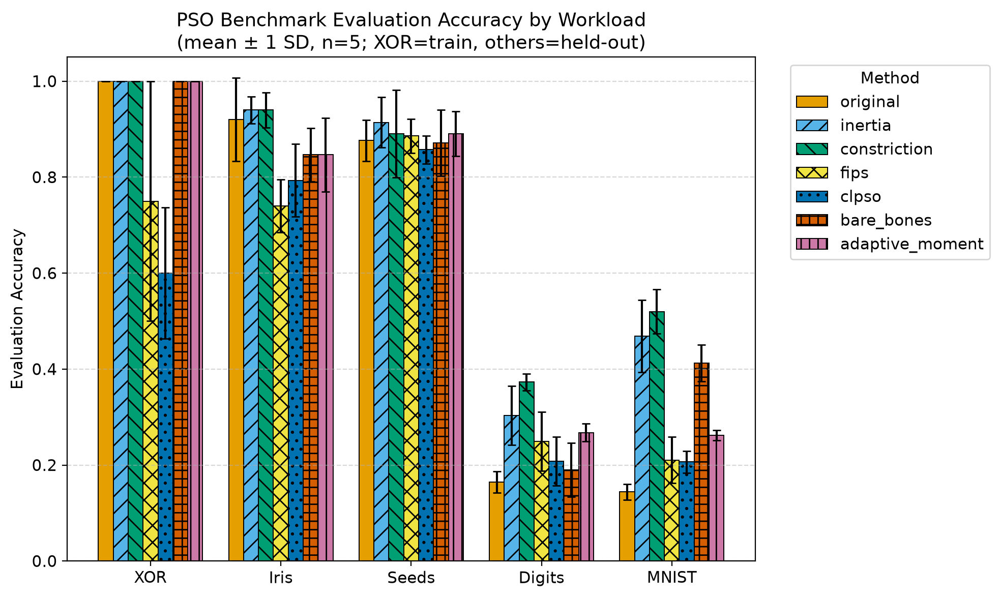 | 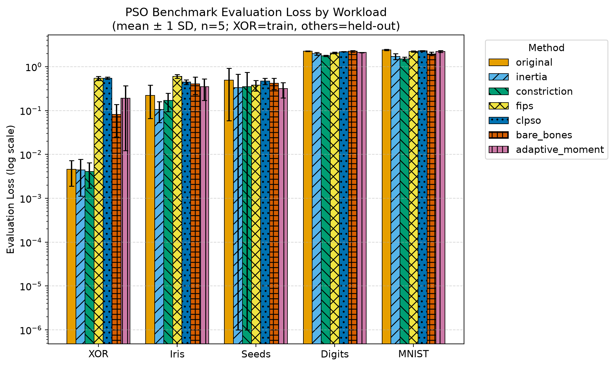 |

| 순위 히트맵 (Rank Heatmap) | 실행 시간 비교 (Runtime) |
| --- | --- |
| 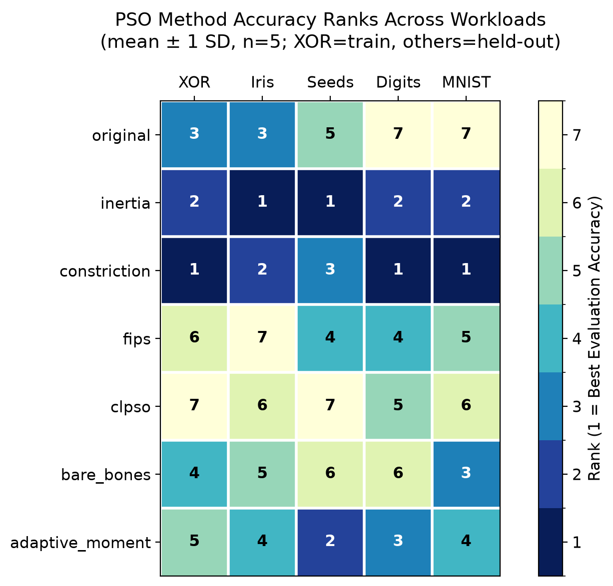 | 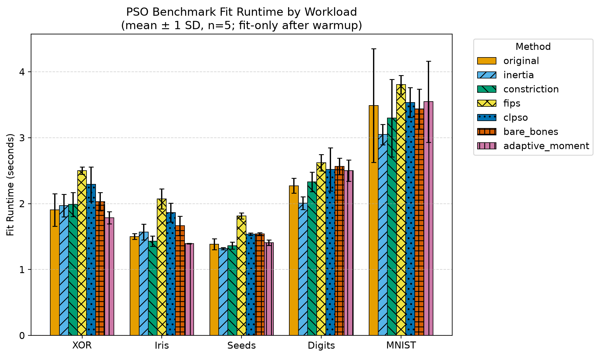 |

---

## 5. MNIST Ablation 연구 (MNIST 10-Profile Ablation Study)

MNIST PCA32 `Linear(32,10)` 워크로드(파티클 30, 세대 80, 시드 46~50)에서 초기화, 적합도 평가, 수렴 제어, 미세조정, 적응형 경로 모멘트 하이퍼파라미터 변형 10개 프로필을 비교 분석하였습니다.

### 5.1 Ablation 종합 성과 매트릭스

| 프로필 식별자 (`profile`) | 검증 정확도 (Eval Acc) | 검증 손실 (Eval Loss) | 학습 정확도 (Train Acc) | 학습 손실 (Train Loss) | 실행 시간 (Runtime) | Acc 순위 | Loss 순위 |
| --- | --- | --- | --- | --- | --- | --- | --- |
| `tuned_adam_100_lr.01` | **85.58% ± 0.24%** | **0.470271 ± 0.011931** | 91.58% ± 0.39% | 0.298524 ± 0.012987 | 4.991s ± 0.434s | 1 | 1 |
| `adaptive_moment_.10` | **63.00% ± 1.83%** | 1.243339 ± 0.102561 | 70.99% ± 1.28% | 0.978244 ± 0.021198 | 4.287s ± 0.289s | 2 | 5 |
| `tuned_full_evaluation` | **62.54% ± 2.80%** | **1.179009 ± 0.050059** | 68.79% ± 1.07% | 1.005140 ± 0.028281 | 3.377s ± 0.469s | 3 | 2 |
| `inertia_tuned` (기준) | 61.62% ± 5.13% | 1.236600 ± 0.124281 | 69.31% ± 2.93% | 0.999514 ± 0.075496 | 3.132s ± 0.409s | 4 | 3 |
| `tuned_particle_reset` | 61.62% ± 5.13% | 1.236600 ± 0.124281 | 69.31% ± 2.93% | 0.999514 ± 0.075496 | 4.176s ± 0.449s | 5 | 4 |
| `tuned_no_mutation` | 60.42% ± 3.04% | 1.249836 ± 0.084985 | 66.86% ± 1.28% | 1.074396 ± 0.043372 | 3.348s ± 0.343s | 6 | 6 |
| `tuned_uniform_initialization` | 56.98% ± 2.40% | 1.619196 ± 0.157329 | 61.60% ± 0.90% | 1.345857 ± 0.048557 | 4.307s ± 0.443s | 7 | 8 |
| `adaptive_moment_.25` | 56.32% ± 2.94% | 1.499979 ± 0.119449 | 63.79% ± 2.42% | 1.228023 ± 0.088967 | 3.291s ± 0.426s | 8 | 7 |
| `adaptive_moment_.50` | 51.86% ± 3.91% | 1.683781 ± 0.121571 | 57.05% ± 2.75% | 1.463700 ± 0.097485 | 3.203s ± 0.270s | 9 | 9 |
| `inertia_canonical` | 46.76% ± 2.44% | 1.720983 ± 0.118092 | 52.77% ± 2.89% | 1.528197 ± 0.079997 | 3.120s ± 0.306s | 10 | 10 |

### 5.2 MNIST Ablation 시각화 차트

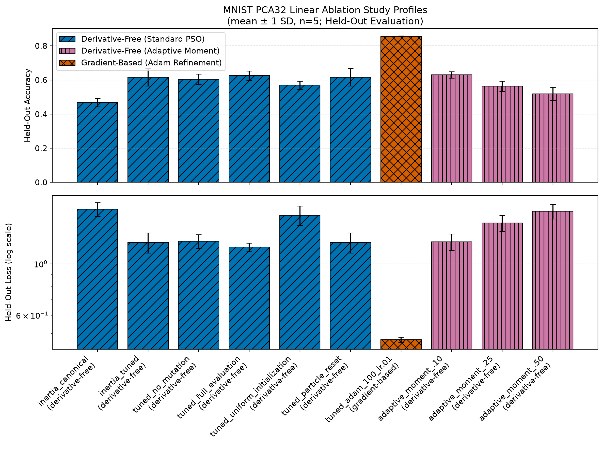

### 5.3 `inertia_tuned` 기준 상대 델타 (Paired Deltas vs `inertia_tuned`)

`inertia_tuned` 프로필(Eval Acc: **61.62%**, Eval Loss: **1.236600**, Runtime: **3.132s**) 대비 각 변형 프로필의 절대 편차량입니다:

1. **`inertia_canonical` vs `inertia_tuned`**:
   - $\Delta$ Eval Acc: **-14.86%p** (46.76% vs 61.62%)
   - $\Delta$ Eval Loss: **+0.484383** (1.720983 vs 1.236600)
   - $\Delta$ Runtime: **-0.012s** (3.120s vs 3.132s)
   - *해석*: 인지·사회 계수, 관성, 속도 제한 및 변이를 함께 조정한 튜닝 프로필이 이 PCA32 워크로드에서 canonical inertia 프로필보다 14.86%p 높은 평균 정확도를 기록했습니다. 개별 요소의 기여는 아래 단일요인 비교로만 제한적으로 해석해야 합니다.
2. **`tuned_no_mutation` vs `inertia_tuned`**:
   - $\Delta$ Eval Acc: **-1.20%p** (60.42% vs 61.62%)
   - $\Delta$ Eval Loss: **+0.013236** (1.249836 vs 1.236600)
   - $\Delta$ Runtime: **+0.216s** (3.348s vs 3.132s)
   - *해석*: `mutation_swarm=0.02`를 제거한 프로필의 평균 정확도가 1.20%p 낮았습니다. $n=5$ 변동 범위가 겹치므로, 변이가 국소 최적점 탈출을 입증했다고 단정할 수는 없습니다.
3. **`tuned_full_evaluation` vs `inertia_tuned`**:
   - $\Delta$ Eval Acc: **+0.92%p** (62.54% vs 61.62%)
   - $\Delta$ Eval Loss: **-0.057591** (1.179009 vs 1.236600)
   - $\Delta$ Runtime: **+0.245s** (3.377s vs 3.132s)
   - *해석*: 미분 무관 프로필 중 최저 손실(**1.179009**)을 기록했습니다. 단, 2,000개 고정 서브셋 평가인 `inertia_tuned`와 달리 3,000개 전체 데이터셋 평가 방식이 적용되어 샘플 수 차이 및 배치 연산 차이에 따른 교란 요인(Confound)이 존재합니다.
4. **`tuned_uniform_initialization` vs `inertia_tuned`**:
   - $\Delta$ Eval Acc: **-4.64%p** (56.98% ± 2.40% vs 61.62%)
   - $\Delta$ Eval Loss: **+0.382596** (1.619196 vs 1.236600)
   - $\Delta$ Runtime: **+1.175s** (4.307s vs 3.132s)
   - *해석*: PyTorch 가중치 기준 노이즈 부가 대신 유니폼 무작위 위치 초기화를 사용할 경우 신경망 적합도 탐색에 불리함을 나타냅니다.
5. **`tuned_particle_reset` vs `inertia_tuned`**:
   - $\Delta$ Eval Acc: **+0.00%p** (61.62% vs 61.62%)
   - $\Delta$ Eval Loss: **0.000000** (1.236600 vs 1.236600)
   - $\Delta$ Runtime: **+1.045s** (4.176s vs 3.132s)
   - *해석*: 최종 평가지표는 기준과 완전히 동일했지만 재초기화 이벤트 텔레메트리가 없으므로, 정체 조건 미충족과 전역 최적해 비영향을 구분할 수 없습니다. 추가 이벤트 계측 없이 수렴 개선 효과를 주장하지 않습니다.
6. **`tuned_adam_100_lr.01` vs `inertia_tuned`**:
   - $\Delta$ Eval Acc: **+23.96%p** (85.58% vs 61.62%)
   - $\Delta$ Eval Loss: **-0.766329** (0.470271 vs 1.236600)
   - $\Delta$ Runtime: **+1.859s** (4.991s vs 3.132s)
   - *해석*: 전체 10개 프로필 중 가장 높은 정확도와 가장 낮은 손실을 기록했습니다. 다만, 본 기법은 순수 미분 무관 기법이 아닌 PSO 수렴 위치 후 100 세대 역전파 Adam 미세조정(Refinement)을 수행하는 경사도 활용(Gradient-assisted) 하이브리드 기법입니다.
7. **`adaptive_moment_.10` vs `inertia_tuned`**:
   - $\Delta$ Eval Acc: **+1.38%p** (63.00% vs 61.62%)
   - $\Delta$ Eval Loss: **+0.006739** (1.243339 vs 1.236600)
   - $\Delta$ Runtime: **+1.155s** (4.287s vs 3.132s)
   - *해석*: 미분 무관(Derivative-Free) 프로필 중 **최고 검증 정확도(63.00% ± 1.83%)**를 기록했습니다. 정확도는 `inertia_tuned` 대비 1.38%p 우수하나, 검증 손실은 1.243339로 `inertia_tuned` (1.236600) 대비 약간 높게 유지되었습니다.
8. **`adaptive_moment_.25` 및 `.50` vs `inertia_tuned`**:
   - `.25`: $\Delta$ Eval Acc **-5.30%p** (56.32%), $\Delta$ Eval Loss **+0.263379** (1.499979)
   - `.50`: $\Delta$ Eval Acc **-9.76%p** (51.86%), $\Delta$ Eval Loss **+0.447181** (1.683781)
   - *해석*: 이 3개 혼합비 설정에서는 $\lambda$가 0.10에서 0.25, 0.50으로 증가할수록 평균 정확도가 낮아지고 손실이 높아지는 패턴이 관찰되었습니다. 다른 모델·예산으로 일반화되는 단조 관계로 해석하지 않습니다.

## 6. 확장 튜닝 및 파티클 스케일링 (Tuning Protocol 1.0.0)

### 6.1 방법론과 데이터 분리

- **모델/데이터**: MNIST 첫 학습 3,000개와 테스트 1,000개, PCA32 whitening, `Linear(32,10)`, `CrossEntropyLoss`.
- **Search**: 첫 3,000개를 stratified 2,400 inner-train / 600 validation으로 분리하고 PCA를 inner-train에만 적합했습니다. 5개 기법의 32개 후보를 파티클 30개, 80세대, 시드 51~53에서 비교하고 평균 validation accuracy 내림차순, 동률 시 loss 오름차순으로 기법별 후보를 선택했습니다.
- **Confirmation**: 선택된 기법별 후보를 전체 학습 3,000개로 다시 적합했습니다. PCA도 전체 학습 데이터에만 다시 적합하고 search에 사용하지 않은 테스트 1,000개를 시드 61~65에서 평가했습니다.
- **Scaling**: 선택된 Adaptive Moment 후보를 시드 71~75에서 파티클 30/60/90/120개로 평가했습니다. 80세대 고정과 약 2,400 particle-epochs 고정을 분리했습니다.
- **공통 조건**: `fixed_subset=2000`, batch 1,000, 반사 경계 ±3, 미분 무관, Adam refinement 없음. 시간은 기법별 비계측 웜업 후 `fit()`만 측정했습니다.

Search가 테스트셋을 사용하지 않도록 데이터와 PCA 적합 범위를 분리했습니다. 모든 161개 레코드는 MPS에서 완료되었고 오류는 0건이었습니다. 총 계측 fit 시간은 search **259.479s**, confirmation **64.745s**, 중복을 제외한 scaling **184.978s**였습니다.

### 6.2 검증 선택 결과

| 기법 | 선택 후보 | Validation Accuracy | Validation Loss |
| --- | --- | ---: | ---: |
| `local_best` | `local_best_r4_constant` | **72.44%** | **0.944913** |
| `constriction` | `constriction_c205_canonical` | 70.89% | 0.984401 |
| `adaptive_moment` | `am_b0.06_s0.5` | 70.17% | 0.950972 |
| `inertia` | `inertia_asymmetric` | 69.72% | 1.029132 |
| `quantum` | `quantum_beta_0.4_0.9` | 56.50% | 1.337709 |

Adaptive Moment 선택값은 $c_0=c_1=1.49618$, $w=0.7298$, velocity limit ratio 0.025, mutation 0.02, `moment_blend=0.06`, `moment_step_size=0.5`, $\beta_1=0.9$입니다. 이는 저장소 기본값이 아니라 이 search 범위에서 선택된 후보입니다.

### 6.3 Held-out 테스트 확인

| 기법 | 선택 후보 | Test Accuracy (Mean ± SD) | Test Loss (Mean ± SD) | Fit Time (Mean ± SD) |
| --- | --- | ---: | ---: | ---: |
| `local_best` | `local_best_r4_constant` | **62.64% ± 2.94%** | **1.211368 ± 0.059575** | 2.512s ± 0.048s |
| `inertia` | `inertia_asymmetric` | 62.30% ± 3.01% | 1.212971 ± 0.078548 | 2.570s ± 0.035s |
| `adaptive_moment` | `am_b0.06_s0.5` | 61.06% ± 0.91% | 1.229627 ± 0.022179 | 2.943s ± 0.256s |
| `constriction` | `constriction_c205_canonical` | 60.66% ± 2.30% | 1.246275 ± 0.044657 | 2.521s ± 0.045s |
| `quantum` | `quantum_beta_0.4_0.9` | 48.58% ± 2.71% | 1.519246 ± 0.052511 | 2.403s ± 0.022s |

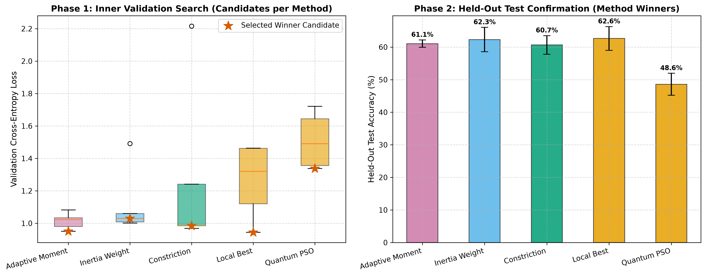

검증 1위였던 `local_best`가 held-out 확인에서도 가장 높은 평균 정확도와 가장 낮은 평균 손실을 기록했습니다. `local_best`와 `inertia`는 동일 30×80 예산에서 Adaptive Moment보다 높은 평균 정확도를 기록했습니다. $n=5$이므로 이 순서의 통계적 유의성이나 다른 워크로드로의 일반화를 주장하지 않습니다.

### 6.4 Adaptive Moment 파티클 스케일링

| 비교 방식 | 파티클 | 세대 | Particle-epochs | Test Accuracy (Mean ± SD) | Test Loss (Mean ± SD) | Fit Time (Mean ± SD) | 30×80 대비 정확도 |
| --- | ---: | ---: | ---: | ---: | ---: | ---: | ---: |
| Fixed epochs | 30 | 80 | 2,400 | 62.12% ± 3.07% | 1.193469 ± 0.086618 | 2.685s ± 0.090s | 기준 |
| Fixed epochs | 60 | 80 | 4,800 | 65.94% ± 0.87% | 1.074629 ± 0.046106 | 5.586s ± 0.517s | +3.82%p |
| Fixed epochs | 90 | 80 | 7,200 | 70.32% ± 2.16% | 0.931880 ± 0.038073 | 8.627s ± 0.448s | +8.20%p |
| Fixed epochs | 120 | 80 | 9,600 | **72.34% ± 1.82%** | **0.902448 ± 0.058380** | 11.174s ± 0.718s | **+10.22%p** |
| Fixed particle-epochs | 30 | 80 | 2,400 | 62.12% ± 3.07% | 1.193469 ± 0.086618 | 2.685s ± 0.090s | 기준 |
| Fixed particle-epochs | 60 | 40 | 2,400 | 50.74% ± 2.66% | 1.534634 ± 0.078628 | 2.786s ± 0.095s | -11.38%p |
| Fixed particle-epochs | 90 | 27 | 2,430 | 47.82% ± 6.31% | 1.610771 ± 0.098843 | 3.109s ± 0.203s | -14.30%p |
| Fixed particle-epochs | 120 | 20 | 2,400 | 41.06% ± 2.36% | 1.800035 ± 0.072261 | 3.029s ± 0.179s | -21.06%p |

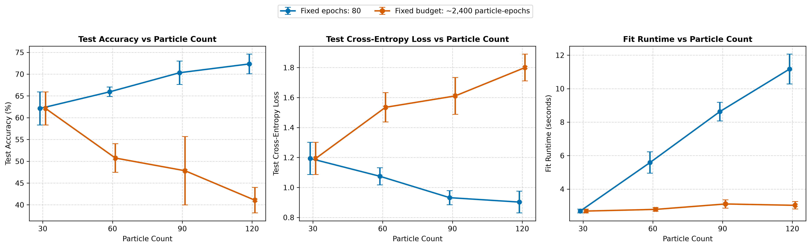

80세대를 유지한 비교에서는 60, 90, 120개 파티클이 각각 **+3.82%p**, **+8.20%p**, **+10.22%p**였고 각 파티클 수에서 5개 paired seed가 모두 30개 기준보다 높았습니다. 그러나 120개 설정의 평균 fit 시간은 30개 대비 **4.16배**였습니다. 약 2,400 particle-epochs를 고정하면 더 많은 파티클 때문에 세대가 40/27/20으로 줄어 모든 비교에서 정확도가 낮았습니다. 이 결과는 파티클 수 자체의 무비용 효과가 아니라 추가 평가 예산과 충분한 세대 수의 결합 효과를 보여줍니다.

### 6.5 확장 연구 해석 한계

1. Search는 시드 3개, confirmation/scaling은 시드 5개로 제한됩니다. 통계적 유의성 검정이나 보편적 우위를 주장하지 않습니다.
2. PCA32 선형 MNIST 한 워크로드의 결과이며 전체 MNIST, CNN, 대형 모델로 직접 일반화할 수 없습니다.
3. validation 평균이 가까운 후보는 시드 수가 늘면 선택 순서가 바뀔 수 있습니다.
4. 테스트셋은 search에 사용하지 않았지만, 공개된 scaling 비교를 추가적인 테스트셋 기반 하이퍼파라미터 선택으로 사용해서는 안 됩니다.
5. fixed-epochs 비교는 총 particle-evaluations가 2,400에서 9,600으로 증가하므로 compute-equal 비교가 아닙니다. fixed particle-epochs도 디바이스 벡터화와 세대별 오버헤드까지 동일하게 만들지는 않습니다.
6. 120×80 replication은 같은 PCA32 데이터와 테스트셋을 다시 평가한 수치 재현성 검증입니다. fresh seed는 스웜 난수에 대해서만 독립적이며, 새로운 표본이나 외부 데이터셋에 대한 독립 검증은 아닙니다.

### 6.6 120p×80e 파티클 스케일링 재현성 검증 (Replication Protocol 1.0.0)

발표된 Adaptive Moment 120-particle × 80-epoch fixed-epoch 결과를 별도 수트([`test/reproduce_scaling.py`](test/reproduce_scaling.py))로 다시 실행했습니다. 데이터 fingerprint `dfe645918ece54c0`, 선택 후보 `am_b0.06_s0.5`, MPS, PyTorch 2.13.0, pso2keras 4.0.0을 baseline과 일치시켰습니다.

사전 선언 합격 조건은 (1) 시드 71~75 exact replay의 시드별 테스트 정확도 최대 절대 차이 $\le 0.005$와 초기 모델 fingerprint 일치, (2) 시드 81~85 fresh-seed 평균 정확도의 baseline 대비 절대 차이 $\le 0.03$, (3) 두 집단 95% t-신뢰구간 중첩입니다.

| 집단 | 시드 | Test Accuracy (Mean ± SD) | 95% t-CI | Baseline 대비 | 판정 |
| --- | --- | ---: | ---: | ---: | --- |
| Baseline | 71~75 | 72.34% ± 1.82% | [70.08%, 74.60%] | 기준 | 기준 |
| Exact replay | 71~75 | 72.34% ± 1.82% | [70.08%, 74.60%] | 시드별 최대 차이 **0.00%p** | **PASS** |
| Fresh seed | 81~85 | **73.60% ± 1.66%** | [71.54%, 75.66%] | **+1.26%p** | **PASS** |

Exact replay의 초기 모델 fingerprint는 5개 시드 모두 baseline과 일치했습니다. Fresh-seed 평균 차이는 1.26%p로 3%p 허용 범위 안이고 두 95% t-신뢰구간도 중첩되어 전체 판정은 **PASS**입니다. 추가 적합 실행은 10회이며 모두 MPS에서 오류 없이 완료되었습니다.

- **검증 실행 명령**: `uv run --locked --extra examples python test/reproduce_scaling.py --device mps`
- **출력 아티팩트**: [`benchmark_results/pso_v4_120p80_replication.json`](benchmark_results/pso_v4_120p80_replication.json), [`benchmark_results/pso_v4_120p80_replication.csv`](benchmark_results/pso_v4_120p80_replication.csv)

### 6.7 120p epoch 확장 수렴 진단 (Epoch Convergence Protocol 1.0.0)

`am_b0.06_s0.5`, 파티클 120개, 시드 71~75를 각각 240세대까지 한 번에 연속 실행하고 20세대 간격의 global-best 체크포인트를 같은 테스트셋에서 진단했습니다. Epoch 80의 시드별 정확도는 기존 120×80 baseline과 최대 차이 0.00%p로 일치하여 궤적 prefix가 재현됐습니다.

| Epoch | Particle-epochs | Training Best Loss (Mean ± SD) | Test Accuracy (Mean ± SD) | Test Loss (Mean ± SD) |
| ---: | ---: | ---: | ---: | ---: |
| 80 | 9,600 | 0.684245 ± 0.046414 | 72.34% ± 1.82% | 0.902448 ± 0.058380 |
| 120 | 14,400 | 0.508942 ± 0.026551 | 78.56% ± 0.88% | 0.686080 ± 0.033467 |
| 160 | 19,200 | 0.426009 ± 0.011667 | 81.58% ± 1.17% | 0.599888 ± 0.027074 |
| 200 | 24,000 | 0.385320 ± 0.008996 | 82.58% ± 0.64% | 0.555652 ± 0.020276 |
| 240 | 28,800 | **0.359582 ± 0.009652** | **83.52% ± 1.05%** | **0.515820 ± 0.018827** |

사전 기준은 (1) 80→240 mean training loss 감소율 1% 이상이면 post-80 optimization 지속, (2) mean test accuracy +1%p 이상이면 유의미한 held-out 개선, (3) 200→240 loss 감소율 1% 미만과 정확도 절대 변화 0.5%p 미만을 동시에 만족하면 late plateau로 분류하는 방식입니다.

실측 80→240 training loss 감소율은 **47.30%**, 정확도 증가는 **+11.18%p**였고 5개 시드 모두 정확도가 상승했습니다. 200→240에서도 loss가 **6.68%** 감소하고 정확도가 평균 **+0.94%p** 변했으며 5개 중 4개 시드가 상승했습니다. 각 시드의 마지막 training-best 갱신 epoch는 240/240/240/239/240이었습니다. 따라서 early stagnation, overfitting, late plateau는 모두 false입니다. 다만 구간별 정확도 이득은 80→120 **+6.22%p**, 120→160 **+3.02%p**, 160→200 **+1.00%p**, 200→240 **+0.94%p**로 감소해 한계효용은 줄고 있습니다.

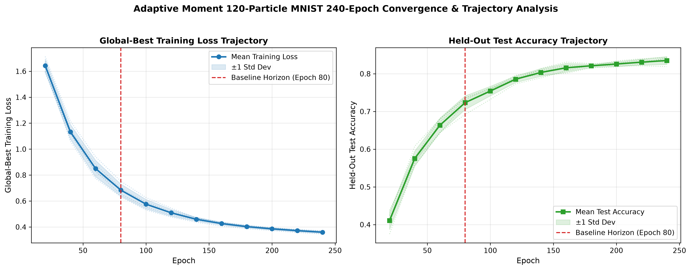

- **실행 명령**: `uv run --locked --extra examples python test/epoch_convergence.py --device mps`
- **출력 아티팩트**: [`benchmark_results/pso_v4_epoch_convergence.json`](benchmark_results/pso_v4_epoch_convergence.json), [`benchmark_results/pso_v4_epoch_convergence.csv`](benchmark_results/pso_v4_epoch_convergence.csv)
- **해석 제한**: 체크포인트 테스트 정확도는 같은 테스트셋을 반복 관찰한 진단값이며, epoch 선택이나 자동 중단에 사용해서는 안 됩니다. 실제 stopping rule은 별도 validation split에 정의해야 합니다.

### 6.8 전체 MNIST 60,000/10,000 학습 (Full MNIST Protocol 1.0.0)

공식 MNIST train 60,000개와 test 10,000개 전체를 사용했습니다. 픽셀 정규화와 flatten 후 PCA32 whitening을 train 60,000개에만 적합했으며 설명 분산 비율 합은 0.743600입니다. 고정된 `am_b0.06_s0.5`를 `evaluation="full"`, `fitness_size=None`, batch 60,000, 파티클 120개, 240 epochs, 시드 71~75로 실행했습니다. 따라서 각 파티클은 매 epoch마다 학습 60,000개 전체에서 평가됐습니다.

| Epoch | Training Best Loss (Mean ± SD) | Full Test Accuracy (Mean ± SD) | Full Test Loss (Mean ± SD) | 2k-fitness study 대비 |
| ---: | ---: | ---: | ---: | ---: |
| 80 | 0.768448 ± 0.026961 | 77.67% ± 1.50% | 0.725023 ± 0.033552 | +5.33%p |
| 120 | 0.589822 ± 0.014141 | 83.28% ± 0.83% | 0.551133 ± 0.018616 | +4.72%p |
| 160 | 0.511683 ± 0.013526 | 85.56% ± 0.56% | 0.482441 ± 0.012016 | +3.98%p |
| 200 | 0.465194 ± 0.010498 | 86.85% ± 0.32% | 0.438875 ± 0.008499 | +4.27%p |
| 240 | **0.436664 ± 0.008101** | **87.70% ± 0.36%** | **0.412078 ± 0.006848** | **+4.18%p** |

80→240에서 training best loss는 **43.18%** 감소하고 테스트 정확도는 **+10.03%p** 상승했습니다. 200→240에서도 loss가 **6.13%** 감소하고 정확도가 **+0.85%p** 상승했으며 모든 시드가 개선됐습니다. 5개 시드 모두 마지막 training-best가 epoch 240에서 갱신되어 full-data 조건에서도 late plateau는 false입니다.

이 프로토콜은 5개 시드 합계 144,000 particle-epochs와 8,640,000,000 particle-sample evaluations를 수행했습니다. 계측된 `fit()` 합계는 165.856초입니다. Full-data 정확도는 공통 checkpoint마다 2k-fitness 연구보다 3.98~5.33%p 높았지만, PCA 적합 범위, fitness objective, evaluation plugin의 RNG 소비가 함께 바뀌므로 정확도 차이는 기술적 비교이며 인과 추정이 아닙니다. 서로 다른 학습 objective의 training loss 절댓값도 직접 비교하지 않습니다.

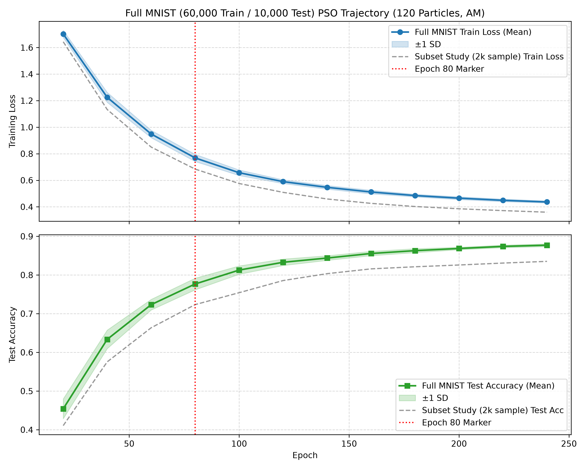

- **실행 명령**: `uv run --locked --extra examples python test/full_mnist_study.py --device mps`
- **출력 아티팩트**: [`benchmark_results/pso_v4_full_mnist.json`](benchmark_results/pso_v4_full_mnist.json), [`benchmark_results/pso_v4_full_mnist.csv`](benchmark_results/pso_v4_full_mnist.csv)
- **해석 제한**: 공식 split 전체를 사용했지만 입력은 PCA32이고 모델은 `Linear(32,10)`입니다. 원본 784차원 PSO나 CNN 결과가 아닙니다. 반복 test checkpoint는 사후 진단일 뿐 stopping rule 선택에 사용하지 않습니다.

### 6.9 원본 MNIST 딥 신경망 아키텍처 및 최적화기 비교 (Deep Accuracy Protocol 1.0.0)

PCA 차원 축소 없이 공식 MNIST 데이터셋 전체(학습 60,000개, 테스트 10,000개) 원본 $1 \times 28 \times 28$ 입력을 대상으로 딥 신경망 아키텍처 및 최적화기 특성을 다중 트랙으로 평가했습니다 (`Deep Accuracy Protocol 1.0.0`, $n=3$, seeds 101~103). 픽셀 정규화 mean(`0.13066`)과 std(`0.308108`)는 학습 60,000개에서만 산출하여 평가 데이터 누수를 차단했습니다. 테스트 10,000개는 히스토리 모니터링 전용으로 사용되었으며, 테스트 성능에 기반한 하이퍼파라미터 선택이나 조기 종료(stopping rule)는 수행하지 않았습니다.

실험 조건: Apple Silicon MPS, PyTorch 2.13.0, batch size 256, lr 0.001. Adam 실행은 10 epochs, PSO 실행은 파티클 30개 × 40세대에 2,000개 고정 서브셋(`fitness_size=2000`) 평가 및 선택된 Adaptive Moment 후보 설정(`am_b0.06_s0.5`, `c0=c1=1.49618`, `w=0.7298`, `velocity_limit_ratio=0.025`, `mutation_swarm=0.02`, `moment_step_size=0.5`)을 적용했습니다. 하이브리드(PSO→Adam) 방식은 PSO 40세대 탐색 후 Adam 10세대를 수행하므로 pure Adam 대비 추가 PSO 계산량을 포함하는 비동등 계산량 설정입니다.

#### 트랙 1: 아키텍처 레인 성과 (Adam 10 Epochs, Mean ± Sample SD, $n=3$)

| 아키텍처 (`arch`) | 모델 구조 및 파라미터 수 | 테스트 정확도 (Mean ± SD) | 테스트 손실 (Mean ± SD) | 98% 정확도 도달 속도 |
| --- | --- | ---: | ---: | --- |
| `raw_linear` | `Linear(784, 10)` (7,850 params) | 92.45% ± 0.10% | 0.268945 ± 0.002050 | 미도달 |
| `raw_mlp` | `Linear(784,128) - ReLU - Linear(128,64) - ReLU - Linear(64,10)` (109,386 params) | 97.70% ± 0.08% | 0.078368 ± 0.002818 | 미도달 |
| `compact_cnn` | `Conv2d(1,8,3) - ReLU - MaxPool2d - Conv2d(8,16,3) - ReLU - MaxPool2d - Linear(784,10)` (9,098 params) | **98.53% ± 0.16%** | **0.043809 ± 0.004907** | **5 Epoch 이내 전 시드 달성** |

`compact_cnn` 아키텍처의 경우 시드 101(4 epoch), 시드 102(3 epoch), 시드 103(5 epoch)에서 모두 5 epoch 이내에 테스트 정확도 98% 이상을 달성했습니다.

#### 트랙 2: 최적화기 레인 성과 (Compact CNN 9,098 Params, Mean ± Sample SD, $n=3$)

| 최적화 기법 (`optimizer`) | 실행 구성 | 테스트 정확도 (Mean ± SD) | 테스트 손실 (Mean ± SD) | 판정 및 특성 |
| --- | --- | ---: | ---: | --- |
| `adam_only` | Adam 10 epochs | **98.53% ± 0.16%** | **0.043809 ± 0.004907** | 역전파 경사하강법 기반 최적화 |
| `pso_only` | PSO 40 epochs (30p × 40e) | 36.76% ± 3.76% | 14.104417 ± 8.075411 | 고차원 전가중치 수렴 실패 |
| `hybrid` (PSO→Adam) | PSO 40e + Adam 10e | 97.30% ± 0.75% | 0.086542 ± 0.023969 | 추가 탐색 연산에도 pure Adam 대비 저조 |

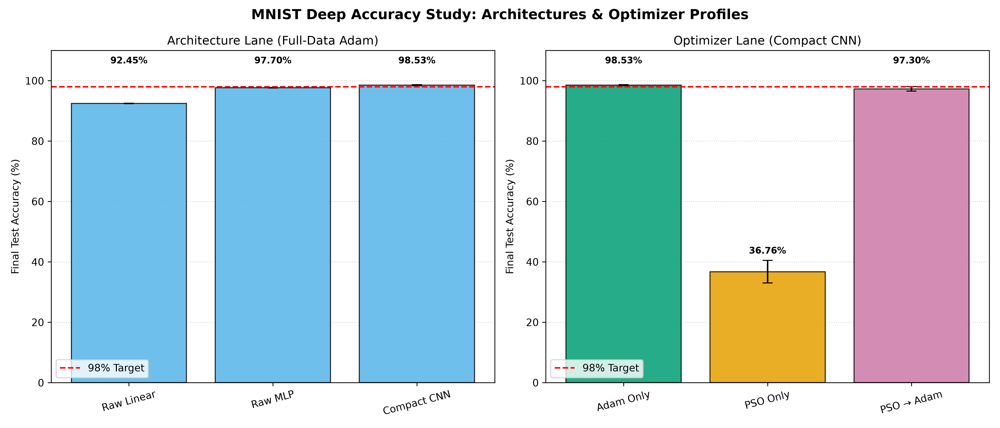

- **실행 명령**: `uv run --locked --extra examples python test/deep_accuracy_study.py --device mps`
- **출력 아티팩트**: [`benchmark_results/pso_v4_deep_accuracy.json`](benchmark_results/pso_v4_deep_accuracy.json), [`benchmark_results/pso_v4_deep_accuracy.csv`](benchmark_results/pso_v4_deep_accuracy.csv)
- **결과 해석 및 한계점**:
  1. **아키텍처 인덕티브 바이어스**: Adam 조건을 고정한 아키텍처 레인에서 Compact CNN은 MLP보다 약 1/12의 파라미터로 정확도가 0.83%p 높았습니다. 원본 이미지의 공간적 구조를 사용하는 것이 측정된 차이에 중요했습니다.
  2. **고차원 전가중치 PSO의 한계**: 이 프로토콜의 30p × 40e·fixed-2k 예산에서 9,098개 CNN 파라미터를 직접 탐색한 PSO는 36.76% ± 3.76%였습니다. 이 결과는 해당 설정에서 역전파를 대체하지 못했음을 보이지만, 더 큰 예산이나 다른 간접 인코딩을 포함한 PSO의 이론적 한계를 증명하지는 않습니다.
  3. **하이브리드 초기화 결과**: PSO→Adam은 97.30% ± 0.75%로 동일한 10-epoch pure Adam의 98.53% ± 0.16%보다 낮았습니다. 추가 PSO 계산량도 포함되므로 측정한 초기화 방식의 실용적 이점은 관측되지 않았습니다.
  4. **표본 및 적용 범위 한계**: 본 실험은 $n=3$ 기술적(descriptive) 표본 측정 결과이며 통계적 유의성이나 일반적 보편 우위로 확언하지 않습니다.


### 6.10 희소 부호 해시 부분공간·단계적 평가·스웜 앙상블 탐색 (MNIST-PSO-RAW-V5 1.0.0)

공식 MNIST 데이터셋(학습 60,000개, 테스트 10,000개) 원본 $1 \times 28 \times 28$ 입력을 대상으로 Compact CNN 아키텍처(9,098개 파라미터)의 고정 희소 부호 해시 부분공간, 단계적 표본 확장 평가, 검증 다양성 기반 스웜 앙상블 탐색을 수행했습니다 (`MNIST-PSO-RAW-V5 1.0.0`).

학습 데이터 60,000개는 탐색 전용 학습 세트 50,000개와 검증 세트 10,000개로 분할되었으며 (`split_seed=20260902`, `split_fingerprint=51b289d9f503a9f3`), 픽셀 정규화 평균(`0.130682`) 및 표준편차(`0.308127`)는 50,000개 탐색 학습 세트에서만 산출하여 데이터 누수를 차단했습니다. 부분공간 차원과 최종 단일 모델·앙상블 구성은 검증 세트에서 선택했으며, 테스트 세트 10,000개는 선택 완료 후 단일 모델과 앙상블의 최종 엔드포인트에만 사용했습니다.

#### 트랙 1: 부분공간 차원 탐색 파일럿 (Pilot Subspace Search, 30p × 160e, fixed-2k subset)

파티클 30개 × 160세대 고정 2,000개 서브셋 조건에서 결정론적 희소 부호 해시 부분공간(290, 1024, 4096차원)과 전가중치(9,098차원) 탐색 성능을 비교했습니다 (`pilot_seed=91`). 손실 함수는 Cross-Entropy Loss를 주 목적(primary)으로 하고 Accuracy를 동률 처리(tiebreak) 지표로 사용했습니다.

| 부분공간 차원 (`dimension`) | 검증 정확도 (%) | 검증 손실 (CE Loss) | 쿼리 수 (Queries) | 샘플 평가 수 (Sample Evals) | 계산 시간 (Wall Time) |
| --- | ---: | ---: | ---: | ---: | ---: |
| `290` | 22.33% | 2.216933 | 4,800 | 9,600,000 | 6.0698s |
| `1024` | 41.34% | 1.960143 | 4,800 | 9,600,000 | 6.0666s |
| `4096` | 55.97% | 1.550738 | 4,800 | 9,600,000 | 6.2638s |
| `full` (9,098-D) | **67.18%** | **1.205564** | 4,800 | 9,600,000 | 6.1629s |

파일럿 예산에서는 전가중치 9,098차원 탐색의 검증 정확도(67.18%)가 가장 높고 손실(1.205564)이 가장 낮아, 확인 프로토콜의 차원으로 선택했습니다.

#### 트랙 2: 단계적 표본 확장 확인 프로토콜 (Confirmation Protocol, 60p × 600e, $n=3$)

파티클 60개 × 600세대 설정으로 3개 무작위 시드(101, 102, 103)에 대해 단계적 표본 확장 스케줄(`2000:420,10000:135,50000:45`)을 적용했습니다. Epoch 1~420은 2,000개 서브셋, 421~555는 10,000개 서브셋, 556~600은 50,000개 전체 탐색 세트로 계층적 평가를 진행했습니다. Epoch 421 및 556의 새 목적함수 평가 전에 모든 파티클의 pbest 적합도를 새 서브셋으로 전수 재평가한 후 gbest를 재구성하여 서로 다른 목적함수의 과거 점수를 직접 비교하지 않았습니다.

- **확인 실행 검증 요약** ($n=3$, seeds 101~103):
  - Validation Best-pbest Accuracy (Mean ± SD): **82.34% ± 0.35%** (std: 0.346987%, 95% t-CI: ±0.861973%)
  - Validation Best-pbest NLL (Mean ± SD): **0.592376 ± 0.018705** (95% t-CI: ±0.046467)

#### 트랙 3: 최종 엔드포인트 및 스웜 앙상블 성과 (Final Endpoint & Swarm Ensemble)

검증 세트 성능에 따라 선택된 단일 최적 모델(Seed 103, Particle 54)과 검증 다양성 기준 상위 Top-5 파티클로 구성된 스웜 앙상블(Top-5 distinct pbest models across seeds: 103/P54, 102/P50, 101/P48, 102/P29, 101/P22)의 최종 공식 Held-out 테스트(10,000개) 성과 비교입니다.

| 엔드포인트 구분 (`endpoint`) | 모델 구성 및 선택 기준 | 검증 정확도 | 검증 NLL | 테스트 정확도 | 테스트 NLL | 테스트 Brier | 테스트 ECE | 상호 불일치도 (Disagreement) |
| --- | --- | ---: | ---: | ---: | ---: | ---: | ---: | ---: |
| **단일 최적 모델** (`single_model`) | Validation NLL 최저 (Seed 103, P54) | 82.64% | 0.571431 | 83.23% | 0.556332 | 0.253921 | 0.085242 | - |
| **스웜 앙상블 (Top-5)** (`ensemble`) | Validation 다양성 Top-5 pbest | 86.60% | 0.548785 | **87.00%** | **0.535928** | **0.236233** | 0.164284 | 0.1585 |
| **앙상블 대비 단일 차이** ($\Delta$) | Ensemble - Single | +3.96%p | -0.022646 | **+3.77%p** | **-0.020404** | **-0.017688** | **+0.079042** | - |

#### 자원 사용량 계측 (Resource Accounting)

- **총 후보 목적함수 평가 쿼리 수**: 127,560 회 (파일럿 19,200 + 확인 108,360)
- **총 샘플 수준 평가 수**: 848,400,000 회 (848.4M)
- **합산 최적화 벽시계 시간**: 473.4657 초 (파일럿 24.5631초 + 확인 448.9026초)

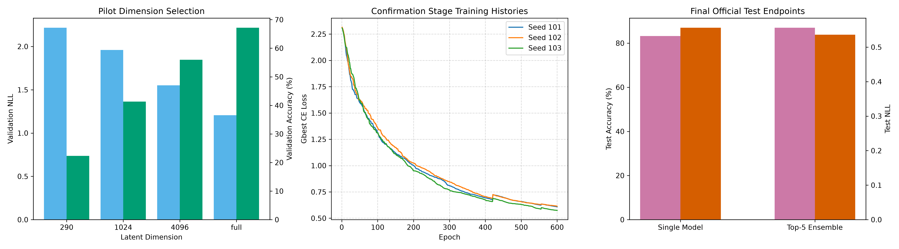

- **실행 명령**: `uv run --locked --extra examples python test/deep_pso_methods.py --device mps`
- **출력 아티팩트**: [`benchmark_results/pso_v5_deep_methods.json`](benchmark_results/pso_v5_deep_methods.json), [`benchmark_results/pso_v5_deep_methods.csv`](benchmark_results/pso_v5_deep_methods.csv)
- **결과 해석 및 특성**:
  1. **파일럿 차원 비교**: 290~4096차원 희소 부호 해시 부분공간은 동일한 30p × 160e 파일럿 예산에서 전가중치(9,098차원)보다 검증 정확도가 낮고 NLL이 높았습니다. 다른 투영, 차원, 예산의 결과까지 일반화하지 않습니다.
  2. **단계적 표본 전환과 회복**: 2k→10k→50k 전환 시 새 목적함수에서 pbest를 재평가하자 손실이 일시 상승하고 정확도가 하락했으며, 이후 각 단계에서 다시 개선됐습니다. 이 점프는 서로 다른 표본 목적함수의 난이도 차이를 반영하며 동일 궤적 손실의 악화로 해석하지 않습니다.
  3. **최종 단일 모델 수렴 한계**: 60p × 600e 단계적 탐색의 단일 모델 테스트 정확도는 83.23%였습니다. 보존된 v4 30p × 40e accuracy-primary PSO의 36.76%보다 높지만 목적함수·데이터 분리·예산이 모두 달라 인과적 개선량으로 해석할 수 없습니다. v4 Adam 10-epoch 평균 98.53%와도 계산 방식·예산이 비동등하며, 측정 정확도는 여전히 15.30%p 낮았습니다.
  4. **앙상블 다양성 및 확률 보정(ECE) 트레이드오프**: 검증 다양성으로 선택한 Top-5 앙상블은 단일 모델보다 테스트 정확도가 3.77%p 높고 NLL/Brier가 낮았지만 ECE는 0.079042 높았습니다(0.085242 → 0.164284). 이 실행은 예측 불일치가 활용 가능한 앙상블 이득과 함께 나타날 수 있음을 보였지만, 높은 손실이나 다양성만으로 일반화·보정 향상을 판정할 수는 없습니다.
  5. **종료 시점의 수렴 상태**: 50k 최종 단계에서 세 시드 모두 기록된 최저 학습 손실이 마지막 Epoch 600에 갱신됐습니다. 따라서 600세대 결과를 수렴 한계로 해석할 수 없으며, 더 긴 50k 단계의 효용은 별도 validation 기반 중단 규칙으로 확인해야 합니다.

### 6.11 V5 탐색 구조 회귀 원인 분리 (MNIST-PSO-RAW-V6 1.0.0)

V5의 83.23% 단일 모델 결과가 고차원 자체의 한계인지, 탐색 구조 변경에 따른 회귀인지 분리하기 위해 Phase A/B 진단을 수행했습니다. 공식 MNIST test split은 로드하지 않았고, train 60,000개만 `split_seed=20260902`로 search 50,000개와 validation 10,000개로 분할했습니다. 모든 비교는 동일한 결정론적 2,000개 search subset, Compact CNN 초기 모델 seed 41, CE loss-primary/accuracy-tiebreak 선택을 사용했습니다.

#### 단일시드 구조 screen (seed 91, 30p × 160e)

| ID | 핵심 변경 | Validation Accuracy | Validation NLL |
| --- | --- | ---: | ---: |
| G8 | 기존 `Optimizer` 의미론 제어군 | **70.99%** | **0.883557** |
| G5 | per-tensor SD + velocity + mutation + bound ±6 | 70.93% | 0.901510 |
| G6 | G5 + initial radius 1.5 | 69.56% | 0.961290 |
| G4 | per-tensor SD + velocity + mutation + bound ±3 | 65.76% | 1.116280 |
| G3 | G0 + mutation 0.02 | 68.07% | 1.130839 |
| G0 | V5 구조 제어군 | 67.73% | 1.183117 |
| G7 | G2 + independent positions | 58.79% | 1.291266 |
| G2 | G0 + initial velocity | 60.72% | 1.296105 |
| G1 | global RMS coordinate scale | 62.32% | 1.437604 |

한 시드에서 G3 mutation은 G0 대비 NLL을 0.052278 낮췄고, G5의 ±6 경계는 G4 대비 정확도를 5.17%p 높이고 NLL을 0.214770 낮췄습니다. 반면 초기 속도만 추가한 G2와 global RMS scale G1은 G0보다 낮았습니다. 이 screen은 확인 대상 선택용이며 단일시드 차이를 일반적 인과 효과로 확정하지 않습니다.

#### 3-시드 확인 (seeds 101–103, 60p × 420e)

| ID | Validation Accuracy (Mean ± Sample SD) | Validation NLL (Mean ± Sample SD) | G8 대비 Accuracy | G8 대비 NLL |
| --- | ---: | ---: | ---: | ---: |
| G8 | **84.92% ± 0.99%** | **0.481440 ± 0.029447** | 기준 | 기준 |
| G6 | 84.25% ± 0.22% | 0.503809 ± 0.015789 | -0.67%p | +0.022369 |
| G5 | 84.24% ± 0.90% | 0.510297 ± 0.024899 | -0.68%p | +0.028857 |
| G0 | 79.53% ± 0.58% | 0.689687 ± 0.008079 | -5.39%p | +0.208247 |
| G1 | 76.95% ± 2.49% | 0.833759 ± 0.123667 | -7.96%p | +0.352319 |

G5와 G6은 사전 선언한 회복 기준(G8 대비 accuracy 1.0%p 이내, NLL 0.05 이내)을 모두 통과했습니다. 따라서 V5 G0의 격차는 9,098차원 자체만으로 설명되지 않으며, 제거했던 탐색 다양성과 좁은 normalized 경계의 묶음이 주요 원인입니다. G6은 사전 순위 규칙인 validation NLL 오름차순에서 G5보다 0.006488 낮아 다음 단계 기준으로 선택됐지만, 차이는 회복 기준보다 작습니다.

개별 요인 판정은 제한적입니다. G1은 G0보다 정확도가 2.57%p 낮고 NLL이 0.144072 높아 per-tensor SD scaling을 global RMS로 교체하는 가설은 기각됐습니다. G5/G6의 회복은 확인됐지만 G2–G4를 3개 시드로 확인하지 않았으므로 초기 속도, mutation, mutation 상호작용, 경계 확장의 독립 효과는 아직 unresolved입니다. G6과 G5 차이는 accuracy +0.01%p/NLL -0.006488로 넓은 초기 반경의 material improvement 기준을 충족하지 못했습니다.

#### 자원·누수 계측 및 다음 단계

- 후보 목적함수 쿼리: **421,200**
- 후보 샘플 평가: **842,400,000**
- 합산 최적화 시간: **596.9980초**
- 합산 validation 평가 시간: **9.1062초**
- 공식 test 데이터 로드 및 평가: **0회**

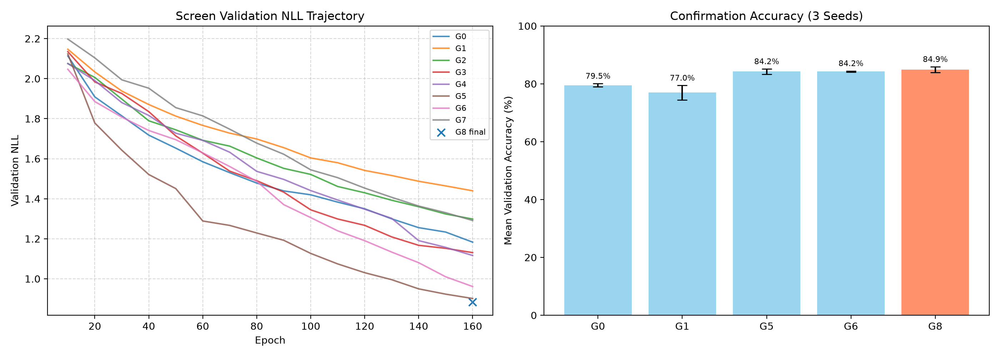

- **실행 명령**: `uv run --locked --extra examples python test/deep_pso_v6.py --phase all --device mps`
- **출력 아티팩트**: [`benchmark_results/pso_v6_phase_b.json`](benchmark_results/pso_v6_phase_b.json), [`benchmark_results/pso_v6_phase_b.csv`](benchmark_results/pso_v6_phase_b.csv)
- **다음 단계**: G6 구조를 기준으로 `sqrt(9098/d)` 반경·속도·경계 보정을 적용한 공정한 subspace 비교(Phase C)를 수행합니다. 이후에만 objective schedule과 transition moment reset을 분리합니다. CCPSO/CSO는 whole-vector validation 성능이 90% 미만에서 plateau일 때까지 보류합니다.

### 6.12 더 무거운 태스크의 전가중치 PSO 실행 가능성 (HEAVY-TASK-PSO-V6 1.0.0)

동일한 보존 기법 G0/G5/G6/G8을 더 큰 모델 및 다른 영상 분류 데이터에 적용했습니다. MNIST와 FashionMNIST 모두 공식 train split만 로드한 뒤 `split_seed=20260902`로 search 50,000/validation 10,000을 층화 분할하고, search 50,000개에서만 정규화 통계를 적합했습니다. 모델 축은 Compact CNN 9,098개와 Conv16→32·FC32 구조의 WideCNN 55,338개 파라미터입니다. 공식 test split 로드와 평가는 모두 0회입니다.

단일시드 screen은 네 workload와 G0/G5/G6/G8의 16개 셀을 12 particles × 40 epochs·fixed-2k로 평가했습니다. Validation NLL 우선, accuracy 동률 판정으로 선택된 normalized 방법은 MNIST Compact/Fashion Compact에서 G6, MNIST Wide/Fashion Wide에서 G5였습니다. 이 선택은 같은 validation split을 사용했으므로 독립적인 일반화 추정치가 아니라 확인 대상 축소 절차입니다.

3-시드 확인은 workload마다 G8과 선택된 normalized 방법을 12 particles × 80 epochs·fixed-10k로 실행했습니다.

| Workload | Method | Validation Accuracy (Mean ± Sample SD) | Validation NLL (Mean ± Sample SD) | 초기 모델 대비 Accuracy | NLL 감소율 | 사전 최적화 기준 |
| --- | --- | ---: | ---: | ---: | ---: | --- |
| MNIST Compact (9,098) | G8 | **49.15% ± 1.32%** | **1.518089 ± 0.061523** | +42.50%p | 34.71% | 통과 |
| MNIST Compact (9,098) | G6 | 45.97% ± 3.55% | 1.642081 ± 0.091398 | +39.32%p | 29.38% | 통과 |
| MNIST Wide (55,338) | G8 | 41.03% ± 4.06% | 1.733351 ± 0.084331 | +31.72%p | 25.43% | 통과 |
| MNIST Wide (55,338) | G5 | **43.86% ± 3.51%** | **1.721259 ± 0.098656** | +34.55%p | 25.95% | 통과 |
| Fashion Compact (9,098) | G8 | **47.00% ± 5.23%** | **1.511217 ± 0.168628** | +38.92%p | 34.87% | 통과 |
| Fashion Compact (9,098) | G6 | 45.62% ± 3.59% | 1.584443 ± 0.053077 | +37.54%p | 31.71% | 통과 |
| Fashion Wide (55,338) | G8 | 41.67% ± 2.27% | 1.615937 ± 0.036692 | +32.90%p | 30.08% | 통과 |
| Fashion Wide (55,338) | G5 | **46.31% ± 7.57%** | **1.525747 ± 0.149706** | +37.54%p | 33.99% | 통과 |

모든 실행은 수치적으로 finite했고 사전 feasibility 기준을 통과했으므로, 약 55k 파라미터 및 FashionMNIST 범위에서도 이 PSO 기법들이 목적함수를 낮추고 초기 정확도를 높이는 것은 확인됐습니다. 다만 최고 평균 정확도가 49.15%에 불과해 유용한 분류기 학습이나 수렴 완료는 확인되지 않았습니다. 80 epochs의 endpoint만 비교했고 plateau 판정용 궤적을 보존하지 않았으므로, 이 프로토콜은 수렴 한계나 추가 세대의 효용을 결정하지 않습니다.

모델 파라미터가 6.08배 증가하면서 12-particle core swarm state는 custom 방법 기준 약 2.08 MiB에서 12.67 MiB, G8 기준 약 2.12 MiB에서 12.88 MiB로 선형 증가했습니다. 확인 실행 처리량은 Compact CNN의 약 1.90~2.19M samples/s에서 WideCNN의 약 0.98~1.04M samples/s로 감소했습니다. G8의 Wide 모델은 Compact 모델보다 MNIST에서 정확도가 8.12%p, FashionMNIST에서 5.34%p 낮았습니다. 반면 screen-selected G5는 두 Wide workload에서 G8 평균을 앞섰지만, 방법 선택에 사용한 validation 재사용과 $n=3$의 큰 변동성(Fashion Wide G5 SD 7.57%p) 때문에 고차원 우월성으로 일반화하지 않습니다.

- 후보 목적함수 쿼리: **30,720**
- 후보 샘플 평가: **245,760,000**
- 합산 최적화 시간: **188.7283초**
- 합산 validation 평가 시간: **6.3826초**
- 공식 test 데이터 로드 및 평가: **0회**

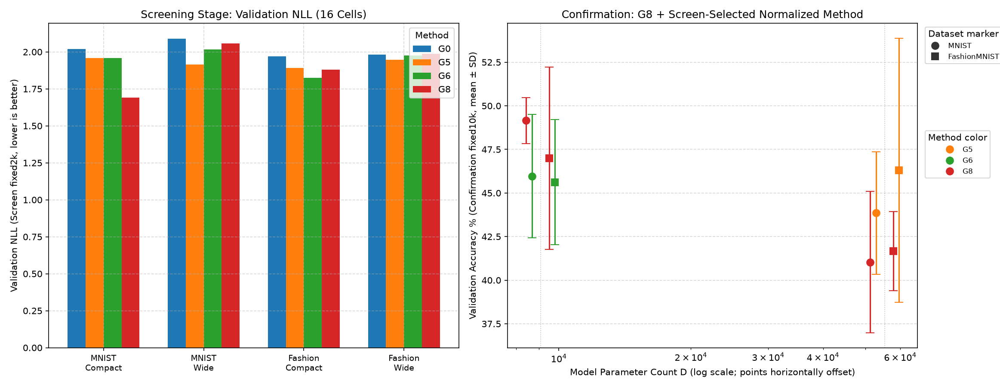

- **실행 명령**: `uv run --no-sync python test/heavy_task_feasibility.py --stage screen --device mps --out-dir /tmp/pso-v6-heavy-screen` 이후 `uv run --no-sync python test/heavy_task_feasibility.py --stage confirm --device mps --screen-artifact /tmp/pso-v6-heavy-screen/pso_v6_heavy_tasks_screen.json`
- **출력 아티팩트**: [`benchmark_results/pso_v6_heavy_tasks.json`](benchmark_results/pso_v6_heavy_tasks.json), [`benchmark_results/pso_v6_heavy_tasks.csv`](benchmark_results/pso_v6_heavy_tasks.csv)
- **판정**: 더 무거운 measured workload에서도 PSO 실행과 제한적 최적화는 가능하지만, 현재 예산의 전가중치 탐색은 실용적인 학습기로 판정하지 않습니다.

### 6.13 고정 부분공간 PSO의 품질·상태 Pareto 반복 연구 (HEAVY-PSO-AUTORESEARCH 1.0.0)

6.12의 네 workload를 대상으로 방법 제안 → 고정 평가 → 분석 → 유지/기각을 반복했습니다. 공식 test split은 끝까지 로드하지 않았고, primary evaluator는 12 particles × 80 epochs × fixed-10k, seeds 101~103, workload별 validation accuracy/NLL, 그리고 persistent core swarm state를 고정했습니다. 후보는 모든 workload에서 baseline state의 50% 이하, accuracy 하락 1%p 이하, NLL 악화 5% 이하를 만족하고, 가장 약한 baseline인 MNIST Wide에서 accuracy 2%p 또는 NLL 5% 이상을 개선해야 통과합니다. 점수는 평균 상대 NLL 개선율 + 평균 accuracy 개선(%p) + 상태 절감 보너스에서 실패 gate당 100점을 차감합니다.

#### 반복 결과와 유지 정책

초기 전역 signed-hash 부분공간은 swarm seed마다 projection도 함께 바꾸어 optimizer 변동과 표현 변동을 혼합했습니다. 별도 projection replica에서 이 문제가 확인됐고, tensor-local 비례 hash는 모든 품질 gate를 크게 악화시켜 기각했습니다. 이후 하나의 전역 projection을 swarm seed 전체에서 고정했습니다. 세 workload에는 ratio 0.5 고정 projection을 사용하고, MNIST Wide에는 기존 단일 실행에서 발견된 projection 592157828을 세 matched seed에서 다시 확인한 뒤 사용했습니다. 반경/속도/경계 multiplier 0.75와 0.5는 MNIST Wide 성능을 각각 41.71%와 36.78%로 낮춰 기각했으며 multiplier 1.0을 유지했습니다.

| Workload | Latent 구성 | State ratio | Baseline Acc / NLL | Development 101~103 Acc / NLL | Confirmation 111~113 Acc / NLL |
| --- | --- | ---: | ---: | ---: | ---: |
| MNIST Compact | fixed global, ratio 0.5, projection 1800044939 | 0.4918 | 49.1533% / 1.518089 | 49.0533% / 1.525704 | 48.4667% / 1.550212 |
| MNIST Wide | fixed global, ratio 0.5, projection 592157828 | 0.5000 | 43.8600% / 1.721259 | 48.3467% / 1.677712 | 45.7233% / 1.734905 |
| Fashion Compact | fixed global, ratio 0.5, projection 1363313651 | 0.4918 | 47.0033% / 1.511217 | 50.7967% / 1.385324 | 53.1967% / 1.328168 |
| Fashion Wide | fixed global, ratio 0.5, projection 189641451 | 0.5000 | 46.3100% / 1.525747 | 48.2633% / 1.531421 | 49.4767% / 1.513876 |

Development 정책 `fixed_global_hybrid_v3`는 모든 고정 gate를 통과했습니다. Score는 **15.030089**, 평균 accuracy 개선은 **+2.5333%p**, 평균 상대 NLL 개선은 **2.4968%**, 최대 state ratio는 **0.5**였습니다. 그러나 정책을 재선택하지 않고 swarm seeds 111~113에서 실행한 confirmation은 **한 gate만 실패**했습니다. 모든 workload의 accuracy/NLL 비열화 gate와 state/safety/accounting gate는 통과했지만 MNIST Wide 개선이 **+1.8633%p**로 사전 기준 +2%p에 0.1367%p 미달했습니다. 따라서 독립 확인된 Pareto 승리로 판정하지 않습니다.

두 seed 집합을 합친 6-seed 수치는 사후 기술 통계일 뿐 gate 판정값이 아닙니다. MNIST Compact/MNIST Wide/Fashion Compact/Fashion Wide accuracy 변화는 각각 **-0.3933/+3.1750/+4.9933/+2.5600%p**, 상대 NLL 변화는 **-1.3088/+0.8686/+10.2216/+0.2031%**였습니다. 이 결과는 고정 projection이 projection-coupled 정책보다 해석 가능하고 평균 품질·상태 Pareto를 개선할 가능성을 보이지만, 새 validation split이나 공식 test 일반화 증거는 아닙니다.

- 총 실제 실행: **312 runs**
- 총 목적함수 쿼리: **299,520**
- 총 샘플 평가: **2,995,200,000**
- 실행 wall time 합: **2,264.4978초**
- 공식 test 데이터 로드 및 평가: **0회**
- 실행기/평가기: [`test/heavy_pso_autoresearch.py`](test/heavy_pso_autoresearch.py), [`test/evaluate_heavy_autoresearch.py`](test/evaluate_heavy_autoresearch.py)
- 요약 아티팩트: [`benchmark_results/pso_v6_heavy_autoresearch.json`](benchmark_results/pso_v6_heavy_autoresearch.json), [`benchmark_results/pso_v6_heavy_autoresearch.csv`](benchmark_results/pso_v6_heavy_autoresearch.csv)
- 전체 반복 결정 로그: [`.omc/autoresearch/heavy-pso-progressive-improvement/runs/20260902T153426Z/decision-log.md`](.omc/autoresearch/heavy-pso-progressive-improvement/runs/20260902T153426Z/decision-log.md)

- **※ 주의 (후속 검증 결과)**: 후속 교차 분할 평가([`REPORT.md` §6.14](#614-heavy-pso-교차-분할-강건성-검증-heavy-pso-cross-split-100))에서 동일 정책이 개발 분할 평가 게이트를 통과하지 못했습니다. 따라서 본 절의 단일 개발 분할 수치는 새 validation split에 대한 강건성 증거가 아닙니다.

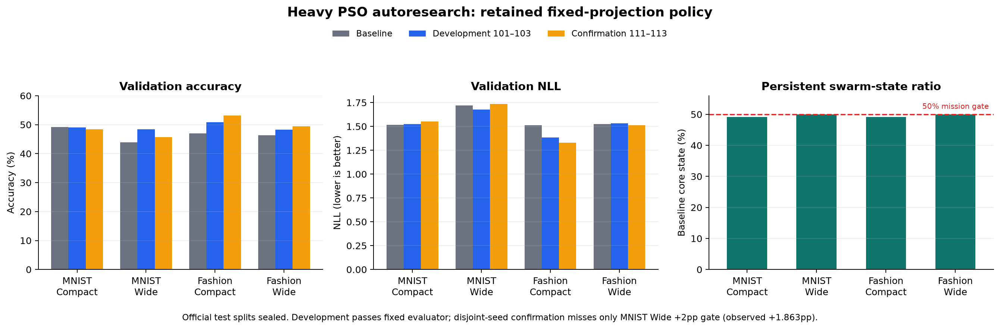
### 6.14 Heavy PSO 교차 분할 강건성 검증 (HEAVY-PSO-CROSS-SPLIT 1.0.0)

§6.13의 고정 부분공간 수축 정책(`fixed_global_hybrid_v3`)이 단일 개발 분할(split 20260902) 이외의 validation 분할에서도 결과를 재현하는지 확인하기 위해, 개발 분할 20260905/20260906과 시드 101~103에서 매칭 baseline을 다시 실행했습니다. 예산은 12 particles × 80 epochs × fixed-10k로 고정했습니다 (`HEAVY-PSO-CROSS-SPLIT 1.0.0`).

#### 6.14.1 실험 설계 및 개념적 구분

1. **결정 탐색(Decision Iterations) vs 개발 변형(Development Variants)**:
   - 총 8회 결정 탐색(Decision Iterations 1~8)을 통해 다양한 부분공간 하이퍼파라미터 및 해시 프로젝션을 탐색했습니다.
   - Iteration 3에서 projection seed replica 1과 replica 2를 별도 평가했으므로, 8회 결정에서 총 9개 개발 변형(Development Variants)을 평가했습니다.
2. **개발 단계(Development Phase) vs 확인 단계(Confirmation Phase)**:
   - **개발 단계**: 2개 무작위 개발 분할(20260905, 20260906) 및 시드 101~103 (변형당 8개 셀, 48개 실행)을 기반으로 엄격한 품질/회귀 게이트를 적용했습니다.
   - **확인 단계**: 개발 단계의 모든 게이트를 통과한 보존 후보에 한해 세 번째 확인 분할(20260907) 및 시드 111~113에서 독립 확인 평가를 수행하도록 정의했습니다.
3. **검증 분할(Validation Split) vs 공식 테스트(Official Test Split)**:
   - 학습 50,000개 / 검증 10,000개 층화 분할(Search/Validation)을 사용했으며, 데이터 정규화 통계는 Search 50,000개에서만 산출했습니다.
   - 공식 테스트 데이터셋(10,000개)은 0회 로드 및 0회 평가로 미사용 완전히 봉인 유지되었습니다 (`official_test_data_loaded = false`, `official_test_evaluations = 0`).
4. **관측 최상위 후보(Best Observed Candidate) vs 최종 보존 정책(Retained Policy)**:
   - 평가된 9개 개발 변형 중 탐색 스코어가 가장 높은 후보(Best Observed Candidate)와 모든 게이트를 통과하여 채택되는 최종 보존 정책(Retained Policy)을 명확히 구분했습니다.

#### 6.14.2 주요 결과 및 게이트 평가

1. **동결 정책 (`fixed_global_hybrid_v3`, Iteration 1)**:
   - §6.13에서 수립된 고정 global projection 및 latent ratio 0.5 정책을 동결하여 교차 평가한 결과, 전체 평균 accuracy 개선은 **+0.1533%p**, NLL 감소는 **0.5546%**에 그쳤습니다.
   - Accuracy·NLL·MNIST Wide 개선의 3개 development 품질 gate를 위반하여 **FAIL**로 판정했습니다. 개발 gate가 닫혔으므로 confirmation gate는 의도대로 실행하지 않았습니다.
2. **관측 최상위 후보 (Iteration 5, Largest-Tensor Hash)**:
   - 8회 결정 탐색 중 최고 스코어(**-185.610686**)를 기록한 Iteration 5(텐서 크기순 비례 해시)는 overall accuracy 개선 **+0.4400%p**, NLL 감소 **3.9493%**, 최악 accuracy 회귀 **-3.0667%p**를 기록했습니다.
   - 그러나 가장 민감한 게이트인 MNIST Wide accuracy에서 **-2.6633%p** (NLL **2.1874%** 악화)로 여전히 회귀가 관측되어 게이트 미달로 **FAIL** 판정되었습니다.
3. **확인 단계 과학적 보류 및 보존 실패**:
   - 9개 개발 변형 전체가 개발 단계 하드 게이트를 통과하지 못함에 따라, 사전 선언된 과학적 엄격성 규칙에 의거하여 확인 분할(20260907) 평가 실행은 **완전히 보류(withheld, confirmation_executed = false)**되었습니다.
   - 최종 보존 정책은 `retained_policy = null`로 확정되었으며, 공식 test split 역시 0회 평가로 미사용 봉인 상태를 유지했습니다.

#### 6.14.3 실험 및 성과 요약 표

| 항목 (Category) | 세부 사양 및 평가 수치 (Details & Metrics) |
| --- | --- |
| **프로토콜 명칭** | `HEAVY-PSO-CROSS-SPLIT 1.0.0` (Publish Protocol: `1.0.0`) |
| **평가 대상 모델/데이터** | MNIST Compact (9,098), MNIST Wide (55,338), Fashion Compact (9,098), Fashion Wide (55,338) |
| **스웜/평가 하이퍼파라미터** | 12 particles × 80 epochs × fixed-10k subset, seeds 101~103, matched baseline 재실행 |
| **데이터 분할 구성** | 개발 분할 2개 (20260905, 20260906) / 확인 분할 1개 (20260907, 실행 보류) |
| **공식 테스트 데이터** | 0회 로드, 0회 평가 (완전 봉인 유지) |
| **결정 탐색 및 개발 변형** | 8회 결정 탐색 (Decision Iterations 1~8) / 9개 개발 변형 (Development Variants, Iter 3 Replica 1/2) |
| **동결 정책 (Iter 1) 결과** | Overall Acc **+0.1533%p**, NLL 감소 **0.5546%**, Worst Acc 회귀 **-7.1767%p**, Worst NLL 회귀 **+14.5682%**, MNIST Wide Acc **-0.3617%p** (FAIL) |
| **관측 최상위 (Iter 5) 결과** | Score **-185.610686**, Overall Acc **+0.4400%p**, NLL 감소 **3.9493%**, Worst Acc 회귀 **-3.0667%p**, MNIST Wide Acc **-2.6633%p** (FAIL) |
| **최종 판정 및 보존 정책** | **FAIL** (`retained_policy = null`), 확인 단계 보류 (`confirmation_executed = false`) |
| **누적 자원 사용 계측** | 432 runs, 414,720 queries, 4,147,200,000 sample evaluations, 3,162.9717s wall time (~52.7 min) |
| **공개 아티팩트 및 시각화** | [`benchmark_results/pso_v7_heavy_cross_split.json`](benchmark_results/pso_v7_heavy_cross_split.json), [`benchmark_results/pso_v7_heavy_cross_split.csv`](benchmark_results/pso_v7_heavy_cross_split.csv), [`history_plt/pso_v7_heavy_cross_split.png`](history_plt/pso_v7_heavy_cross_split.png) |
| **반복 결정 로그 경로** | [`.omc/autoresearch/heavy-pso-cross-split-robustness/runs/20260903T162504Z/decision-log.md`](.omc/autoresearch/heavy-pso-cross-split-robustness/runs/20260903T162504Z/decision-log.md) |

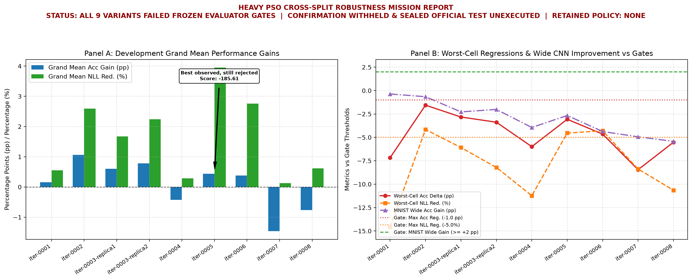

#### 6.14.4 재현 실행 및 아티팩트 발행 명령

```shell
# 1. 교차 분할 탐색 미션 실행 (개발 단계)
uv run --no-sync python test/heavy_pso_cross_split.py --phase development --device mps

# 2. 개별 변형 평가 실행 예시
uv run --no-sync python test/evaluate_heavy_cross_split.py --development .omc/autoresearch/heavy-pso-cross-split-robustness/runs/20260903T162504Z/candidates/iteration-0001-development.json --output .omc/autoresearch/heavy-pso-cross-split-robustness/runs/20260903T162504Z/evaluations/iteration-0001-development.json

# 3. 공개 아티팩트 및 시각화 생성 명령
uv run --no-sync python test/publish_heavy_cross_split.py --source-dir .omc/autoresearch/heavy-pso-cross-split-robustness/runs/20260903T162504Z --output-json benchmark_results/pso_v7_heavy_cross_split.json --output-csv benchmark_results/pso_v7_heavy_cross_split.csv --output-plot history_plt/pso_v7_heavy_cross_split.png
```

---

### 6.15 학습 후 예측공간 PSO 앙상블 연구 (POST-TRAINING-PSO-ENSEMBLE 1.1.0)

#### 6.15.1 연구 질문과 설계

본 연구는 이미 학습된 CompactCNN의 예측을 재사용하여, 다섯 모델의 출력 확률을 하나의 가중 평균으로 결합할 때 저차원 PSO가 유용한지를 평가했습니다. MNIST와 FashionMNIST 각각에 대해 split seed **20260904**, 50,000개 search 샘플과 10,000개 validation 샘플을 사용했고, 정규화 통계도 search 샘플에서만 계산했습니다. 모델 pool은 seeds 201~205의 독립 CompactCNN(각 **9,098 parameters**) 다섯 개이며, 각 모델은 Adam 10 epochs, learning rate 0.001, batch size 256으로 학습했습니다. 다섯 모델의 validation 확률 캐시 shape은 `[5, 10000, 10]`이고, 최적화 중 base CNN forward pass는 0회였습니다.

최적화 변수는 다섯 출력의 비음수 합이 1인 simplex 가중치 $w$뿐입니다. 따라서 이는 **prediction-space ensemble**이며, 파라미터를 평균내는 model soup가 아닙니다. Model soup의 weight averaging과 permutation 정렬을 다루는 문헌은 이 연구의 조작이나 결론을 뒷받침하는 직접적인 비교가 아닙니다 [arXiv:2203.05482](https://arxiv.org/abs/2203.05482), [arXiv:2209.04836](https://arxiv.org/abs/2209.04836). 비교 방법은 uniform, validation NLL에 대한 uniform temperature scaling, simplex 제약 SLSQP, 그리고 PSO입니다. PSO는 constriction movement, loss renewal, 30 particles, particle bounds $[-4,4]$, reflective boundary, velocity limit ratio 0.1, initial position noise 0, swarm seeds 301~303을 고정했습니다.

#### 6.15.2 누수 방지와 사전 선언된 반복

- 모델 학습, temperature fitting, SLSQP/PSO 가중치 선택은 모두 search/validation 단계에서만 수행했습니다. 공식 test split은 정책 동결 전 로드 0회·평가 0회였습니다.
- Iteration 0의 독립 evaluator가 per-workload test-seal field lookup을 교정한 뒤 wall-efficiency gate만 실패한 것을 확인했습니다. 품질·안정성 gate와 세 swarm seed의 수렴 결과는 유지하고, 결정 로그에 따라 PSO epochs만 50에서 30으로 줄였습니다. pool, objective, seed, split, baseline, threshold, selection rule은 바꾸지 않았습니다.
- 동결된 정책이 모든 development gate를 통과한 뒤에만 공식 test를 dataset별 1회 로드하여 pool 5회 forward와 50-epoch single 1회 forward로 확인했습니다. 그 뒤의 tuning/rerun은 0회입니다. 이 순서로 validation 선택과 one-shot test 확인을 분리했지만, 하나의 split과 하나의 final test endpoint만 사용했다는 한계는 남습니다.

Iteration 0(30 particles × 50 epochs)은 seed당 1,500 objective evaluations를 사용했습니다. PSO는 SLSQP와 같은 six-decimal validation NLL에 도달했지만, median one-seed wall ratio가 MNIST **13.14%**, FashionMNIST **12.05%**로 frozen 10% ceiling을 넘었습니다. MNIST validation NLL은 PSO/SLSQP **0.045902**, uniform **0.046385**, 10-epoch reference **0.060105**, equal-epoch-budget 50-epoch single **0.073988**였고, FashionMNIST는 각각 **0.285338**, **0.286751**, **0.303799**, **0.289660**이었습니다. SLSQP는 workload당 23 evaluations와 약 0.011초, PSO는 workload당 1,500 evaluations와 약 2.98~3.29초를 사용했으며, uniform temperature는 두 workload에서 PSO보다 낮은 validation NLL을 보였습니다. 이 결정과 실패 사유는 [post-training decision log](.omc/autoresearch/post-training-pso-ensemble/runs/20260904T093144Z/decision-log.md)에 기록되어 있습니다.

Iteration 1은 다른 조건을 바꾸지 않고 30 particles × 30 epochs로 축소했습니다. seed당 **900 queries**와 **9,000,000 candidate-sample evaluations**를 사용했고, 세 swarm seed가 모두 같은 six-decimal PSO NLL을 재현했습니다. Runner의 13개 집계 gate와 독립 evaluator가 재계산한 14개 development hard gate가 모두 통과했습니다.

#### 6.15.3 Validation 및 one-shot test 결과

아래 값은 accuracy(%) / NLL이며, PSO 행은 validation에서 frozen selected seed 301을 사용한 결과입니다. SLSQP와 PSO의 validation NLL은 두 dataset 모두 six-decimal 수준에서 같지만, test에서는 마지막 decimal 차이가 남습니다.

| 방법 | MNIST validation | MNIST test (one-shot) | FashionMNIST validation | FashionMNIST test (one-shot) |
| --- | ---: | ---: | ---: | ---: |
| 10-epoch single | 98.23 / 0.060105 | 98.47 / 0.044991 | 89.47 / 0.303799 | 88.90 / 0.314516 |
| 50-epoch single (equal epoch budget) | 98.52 / 0.073988 | 98.60 / 0.062102 | 90.32 / 0.289660 | 89.93 / 0.302348 |
| Uniform ensemble | 98.63 / 0.046385 | 98.86 / 0.036184 | 90.28 / 0.286751 | 89.65 / 0.293522 |
| Uniform + temperature | 98.63 / 0.045355 | 98.86 / 0.034129 | 90.28 / 0.285048 | 89.65 / 0.291996 |
| SLSQP simplex weights | 98.60 / 0.045902 | 98.83 / 0.036179 | 90.42 / 0.285338 | 89.54 / 0.291696 |
| PSO simplex weights | 98.61 / 0.045902 | 98.83 / 0.036178 | 90.42 / 0.285338 | 89.54 / 0.291700 |

Evaluator의 cross-dataset mean은 equal-budget single 대비 validation NLL **19.726% 감소**와 accuracy **+0.095%p**, test NLL **22.633% 감소**와 accuracy **-0.080%p**였습니다. 이는 PSO가 단일 모델보다 NLL을 낮추면서도 uniform 대비 사전 선언된 regression gate를 넘지 않았다는 기술통계이지, PSO의 일반적 정확도 우월성은 아닙니다. Test에서 uniform+temperature는 MNIST에서 PSO보다 NLL이 낮고 accuracy가 **0.03%p 높았습니다**. FashionMNIST에서는 uniform+temperature NLL이 **0.291996**으로 PSO의 **0.291700**보다 높았지만, accuracy는 **0.11%p 높았습니다**.

#### 6.15.4 계산비용과 full-weight G8과의 기술적 비교

두 iteration을 합친 post-training study의 PSO 연구 비용은 **14,400 queries**, **144,000,000 candidate-sample evaluations**, research wall time **30.2907초**였습니다. 이 중 최종 Iteration 1은 **5,400 queries**, **54,000,000 candidate-sample evaluations**, research wall time **11.1512초**였고, validation에서 선택된 endpoint의 production wall time은 **3.7888초**였습니다. 다음 비율은 모두 **Iteration 1 내부 비교**이며 두 iteration 합산 비용을 한 iteration의 Adam/pool 학습 비용으로 나눈 값이 아닙니다. 선택된 production PSO 총시간을 Iteration 1의 다섯 모델 pool 학습 총시간 **44.4624초**로 나눈 비율은 정확히 **8.521376%**(소수 셋째 자리 반올림 **8.521%**)입니다. Development gate가 직접 확인한 workload별 median one-seed 비율은 MNIST **8.563655%**, FashionMNIST **8.479599%**이며, Iteration 1 artifact의 `pso_to_pool_wall_ratio`는 이 두 workload 비율의 중앙값 **8.521627%**(소수 셋째 자리 반올림 **8.522%**)입니다. 두 workload 모두 10% ceiling 아래였습니다. Iteration 1의 SLSQP는 workload당 23회, 총 **46 evaluations**, 총 **0.0201초**였습니다. Validation cache는 dataset당 pool 5회와 long single 1회, 총 12 forward passes를 사용했습니다. 앙상블은 모델 다섯 개를 보존하고 prediction inference도 다섯 번 수행하므로 single model 대비 storage/inference 경로가 **5배**입니다. 이 비용을 포함해도 …

다음 표는 같은 CompactCNN parameter count를 사용한 [HEAVY-TASK-PSO-V6 artifact](benchmark_results/pso_v6_heavy_tasks.json)의 full-weight G8 semantic control과의 **기술적(descriptive) 비교**입니다. G8은 9,098개 전가중치를 직접 탐색한 12 particles × 80 epochs, fixed-10k validation, seeds 101~103 실행입니다. Post-training 행은 validation에서 선택된 PSO seed 301의 endpoint이고, G8 행은 세 seed의 평균입니다. 또한 post-training은 5개 모델의 5차원 prediction-space weight를 탐색하므로 두 행은 요약 통계, 목적함수, 최적화 공간이 모두 다릅니다.

| 연구/방법 | 요약 통계 | 최적화 공간 | MNIST validation accuracy / NLL | FashionMNIST validation accuracy / NLL | 공식 test |
| --- | --- | --- | ---: | ---: | --- |
| Post-training PSO (Iteration 1) | validation-selected seed 301 | 5-way prediction simplex | 98.61% / 0.045902 | 90.42% / 0.285338 | 98.83% / 0.036178; 89.54% / 0.291700 |
| Full-weight CompactCNN G8 (V6) | seeds 101~103 mean | 9,098 weights | 49.1533% / 1.518089 | 47.0033% / 1.511217 | 로드/평가 0회 |

선택 endpoint와 3-seed mean 사이의 기술통계 차이는 MNIST에서 **+49.4567%p, NLL -1.472187**, FashionMNIST에서 **+43.4167%p, NLL -1.225879**(post-training PSO minus G8)입니다. 그러나 이 차이는 짝지어진 추정량이 아니며, model-soup 대 full-weight PSO의 인과 비교나 일반화 증거도 아닙니다. V6 G8의 split seed는 **20260902**, 공식 test는 봉인되었고, post-training study는 split seed **20260904**에서 이미 Adam으로 학습된 pool을 사용했습니다. V6 전체 study의 자원은 30,720 queries, 245,760,000 sample evaluations, summed optimization wall time 188.7283초, validation wall time 6.3826초였으며, 이 수치 역시 네 workload와 G0/G5/G6/G8 실행을 합친 값입니다. 따라서 full-weight G8 수치는 “전가중치 PSO를 실용적 학습기로 판정하지 않는다”는 기존 feasibility 결과를 보강하지만, post-training 앙상블의 test accuracy를 설명하는 대조군으로 사용하지 않습니다.

#### 6.15.5 문헌과 해석의 경계

Deep ensembles는 여러 독립 predictor의 predictive uncertainty를 실용적으로 추정할 수 있음을 보였고([arXiv:1612.01474](https://arxiv.org/abs/1612.01474)), temperature scaling은 단일 scalar로 calibration을 개선하는 간단한 post-processing으로 제시되었습니다([arXiv:1706.04599](https://arxiv.org/abs/1706.04599)). 본 연구에서 uniform+temperature가 validation/test NLL과 ECE를 개선한 관측은 이 두 문헌과 방향이 일치하지만, 두 dataset·한 split의 결과를 넘어선 보장은 아닙니다. PSO로 diversity와 accuracy를 함께 고려한 weighted ensemble을 구성한 선행 연구([DOI:10.3390/a13100255](https://doi.org/10.3390/a13100255))도 있으나, 그 연구는 mixed-binary learner selection과 UCI dataset들을 포함하는 다른 설계입니다. 또한 초기 신경망 ensemble 연구([DOI:10.1016/0893-6080(92)90023-1](https://doi.org/10.1016/0893-6080(92)90023-1))는 ensemble의 일반적 동기를 제공할 수 있을 뿐, 본 PSO 비용 비교의 실험적 근거는 아닙니다.

#### 6.15.6 한계와 결정

1. **선택 편향과 표본 범위**: validation split 하나, dataset 두 개, CompactCNN 하나, PSO swarm seed 세 개뿐입니다. validation에서 방법과 PSO seed를 선택한 뒤 test를 한 번 확인했으므로 test leakage는 피했지만, 반복 split·외부 dataset·독립 replication은 없습니다.
2. **비동등한 대조군**: 50-epoch single은 pool의 합산 epoch와 맞춘 equal-epoch-budget 비교이며, 정확한 hardware FLOP 또는 병렬화 비용 동등성을 증명하지 않습니다. V6 G8은 전가중치 직접 탐색이고 split과 objective가 달라 post-training과의 accuracy/NLL 차이를 causal effect로 읽을 수 없습니다.
3. **저차원 smooth objective의 특수성**: 다섯 확률 출력의 simplex NLL은 비교적 매끄러운 저차원 함수라서, PSO 900 evaluations가 SLSQP 23 evaluations와 같은 NLL을 얻은 사실은 이 설정에서의 redundancy를 보여줍니다. 모든 비선형·불연속 목적함수에서 PSO가 중복된다는 뜻은 아닙니다.
4. **저장·추론 비용**: 다섯 모델을 보존하고 다섯 출력 forward를 수행해야 하므로 single model보다 5배 경로가 필요합니다. 본 연구는 이 ensemble overhead를 제거하거나 model soup으로 대체하지 않았습니다.

**결정**: smooth prediction-space NLL에는 먼저 **uniform + temperature**를 사용하고, 명시적인 simplex weight가 필요하면 **SLSQP**를 우선합니다. PSO는 현재 연구에서 SLSQP보다 품질을 추가로 개선하지 못하면서 더 많은 query와 wall time을 사용했으므로 이 경로의 기본 optimizer로 채택하지 않습니다. 향후 PSO는 gradient가 없거나 불연속·이산인 architecture/subset/diversity 선택 문제처럼 SLSQP가 직접 다루기 어려운 목적함수에서만 별도 protocol과 leakage 방지 확인을 거쳐 연구합니다. 이 결론은 PSO 전체의 실패 선언이나 full-weight G8과의 일반적 우열 주장이 아니라, 본 post-training prediction-space study의 bounded decision입니다.

**출력 아티팩트**: [`benchmark_results/pso_v8_post_training_ensemble.json`](benchmark_results/pso_v8_post_training_ensemble.json), [`benchmark_results/pso_v8_post_training_ensemble.csv`](benchmark_results/pso_v8_post_training_ensemble.csv), [`benchmark_results/pso_v8_post_training_ensemble_evaluation.json`](benchmark_results/pso_v8_post_training_ensemble_evaluation.json), [`history_plt/pso_v8_post_training_ensemble.png`](history_plt/pso_v8_post_training_ensemble.png), [decision log](.omc/autoresearch/post-training-pso-ensemble/runs/20260904T093144Z/decision-log.md).


## 7. 결과 해석 및 실무 권고사항 (Interpretation & Recommendations)

1. **고전 무브먼트 기법 선택**:
   - Protocol 2.0.0의 5개 워크로드 고정 예산에서는 `constriction`과 `inertia`가 가장 낮은 평균 순위를 기록했습니다. 새로운 워크로드에서는 둘을 우선 비교하되 보편적 우위로 간주하지 않아야 합니다.
   - 확장 MNIST 연구에서는 새 `local_best`의 반경 4 후보가 동일 30×80 held-out 확인에서 가장 높은 평균 정확도(62.64%)와 가장 낮은 손실(1.211368)을 기록했습니다. 다른 데이터셋에서는 별도 검증이 필요합니다.
2. **`adaptive_moment` 독자 기법**:
   - 기존 ablation의 $\lambda=0.10$은 해당 10개 프로필 중 미분 무관 최고 정확도였지만, 확장 search에서 선택된 $\lambda=0.06$/step 0.5는 동일 예산 held-out 확인에서 `local_best`와 `inertia`보다 낮았습니다.
   - 더 많은 파티클은 80세대를 유지해 총 평가량을 늘릴 때 성능을 높였고, particle-epochs를 고정하면 낮아졌습니다. 파티클 수와 계산 예산을 함께 보고 선택해야 합니다.
   - 120개 파티클에서는 80세대가 충분한 수렴 horizon이 아니었습니다. 이 워크로드에서 계산 예산이 허용되면 더 긴 horizon을 사용하되, 테스트 체크포인트가 아니라 별도 validation metric으로 중단 시점을 결정해야 합니다.
   - 공식 MNIST 전체 학습에서는 240세대 정확도가 87.70%로 2k-fitness 연구보다 높았습니다. 다만 full objective와 PCA 적합 범위가 함께 달라졌으므로 full-data 사용 하나의 인과 효과로 분리하지 않습니다.
3. **`quantum` 기법**:
   - 이 후보 범위의 QPSO는 held-out 정확도 48.58%로 가장 낮았습니다. 하나의 워크로드 결과이며 QPSO 일반 성능으로 해석하지 않습니다.
4. **Adam refinement**:
   - 경사도 사용이 허용될 때 `tuned_adam_100_lr.01`은 기존 ablation에서 가장 높은 정확도와 가장 낮은 손실을 기록했습니다. 순수 미분 무관 방법과 별도 범주로 비교해야 합니다.
5. **초기화 선택**:
   - 기존 PCA32 ablation에서 `uniform` 초기화는 `model_noise`보다 평균 정확도가 4.64%p 낮았습니다. 이는 해당 경계·모델·예산에 한정된 관찰입니다.

6. **딥러닝 아키텍처 및 PSO 역할 권고사항 (Deep Accuracy Insights)**:
   - 측정된 설정에서 실무적 권장 경로는 **Compact CNN + Adam**입니다.
   - 9,098개 CNN 전가중치를 직접 탐색한 PSO는 이 고정 예산에서 역전파를 대체하지 못했습니다. PSO를 딥러닝 파이프라인에 유지하려면 전가중치 대체보다 저차원 아키텍처·하이퍼파라미터 탐색 후 Adam으로 가중치를 학습하는 역할 분담이 합리적입니다. 이 역할 분담 자체는 본 프로토콜에서 비교하지 않은 공학적 권고입니다.
7. **희소 부호 해시 부분공간·단계적 평가·스웜 앙상블 탐색 권고사항 (V5 Insights)**:
   - V5의 동일 30p × 160e 파일럿에서는 희소 부호 해시 부분공간(290~4096차원)보다 전가중치(9,098차원) 검증 성능이 높았습니다. 그러나 V6 진단에서 동일 latent radius가 차원이 작을수록 decoded per-parameter RMS를 축소하는 교란이 확인됐으므로, 이 결과는 부분공간 자체의 열위 근거가 아닙니다.
   - 단계적 표본 확장(2k→10k→50k) 적용 시 목적 함수 변경에 맞춰 pbest 재평가를 수행하여 수렴 편향을 방지해야 합니다.
   - 스웜 내 검증 상위 다양성 파티클 기반 Top-5 앙상블은 단일 모델 대비 정확도(+3.77%p)와 NLL/Brier를 개선하였으나, ECE가 악화(+0.079042)되었습니다. 단순히 파티클 다양성이나 손실 잔여물이 높다고 해서 일반화나 신뢰성이 비례하여 향상된다고 가정하지 않아야 합니다.
8. **V6 탐색 구조 권고사항**:
   - V5의 zero-velocity/no-mutation/normalized ±3 묶음은 동일 2k·60p×420e 조건에서 기존 `Optimizer`보다 5.39%p 낮았습니다. mutation·초기 속도·±6 경계를 복원한 G5/G6은 사전 회복 기준을 통과했으므로 다음 탐색은 G6을 기준으로 진행합니다.
   - global RMS coordinate scale은 per-tensor SD보다 낮았으므로 좌표 정규화 자체를 제거하지 않습니다. mutation과 경계 확장의 독립 효과는 아직 3-시드 확인 전이므로 각각을 확정 원인으로 표현하지 않습니다.
9. **더 무거운 태스크에 대한 PSO 역할 권고사항**:
   - 55,338개 파라미터와 FashionMNIST에서도 모든 실행이 finite했고 초기 모델 대비 개선됐으므로 기술적 실행 가능성은 확인됐습니다. 그러나 41.03~49.15% validation accuracy는 전가중치 PSO를 실용적 학습 경로로 권고할 근거가 아닙니다.
   - 파라미터 수 증가로 swarm state가 6.08배 증가하고 처리량이 대략 절반으로 감소했습니다. 다음 확장 실험은 더 큰 전가중치 모델보다 저차원 subspace/협력적 block 탐색 또는 PSO 기반 하이퍼파라미터 탐색을 우선해야 합니다. 이 대안들의 성능은 본 프로토콜에서 측정하지 않았습니다.
---

## 8. 연구 한계점 (Limitations)

1. **소규모 샘플 사이즈 ($n=5$) 및 신뢰구간 측정 한계**:
   - 본 벤치마크는 무작위 시드 5개(41~45 및 46~50)에 대한 측정을 바탕으로 하였습니다. 샘플 크기가 $n=5$로 제한되어 일부 지표에서 표준편차가 크며, 95% 신뢰구간(CI)의 범위를 좁히는 데 한계가 있습니다.
2. **순위(Rank) 지표의 서열적(Ordinal) 특성**:
   - 평균 순위(Mean Rank) 지표는 절대적인 성능 격차 수치를 반영하지 않고 상대적인 순위 수치만을 반영합니다. 따라서 순위 차이가 절대적인 손실/정확도 차이와 정비례하지 않습니다.
3. **`tuned_full_evaluation` 비교 시 교란 요인 (Confounders)**:
   - `tuned_full_evaluation` (3,000개 전체 데이터)과 고정 서브셋 기법(2,000개 서브셋) 간의 손실 수치 비교는 평가에 사용된 데이터 샘플 수 및 배치 연산 차이가 개입된 교란 요인을 포함하고 있습니다.
4. **소형/얕은 신경망 모델 범위 한계**:
   - 메인 및 튜닝 평가 대부분은 1~2개 레이어의 소형 MLP와 PCA32 선형 모델이며, 딥 프로토콜도 9,098개 파라미터 Compact CNN 하나로 제한됩니다. 수만~수억 개 파라미터 모델로의 직접 일반화에는 근거가 부족합니다.

5. **확장 튜닝의 선택 불확실성**:
   - 32개 후보 search는 시드 3개만 사용했습니다. validation 차이가 작은 후보의 순위는 추가 시드에서 바뀔 수 있습니다.
6. **파티클 스케일링의 계산량 차이**:
   - 80세대 고정 비교는 파티클 수와 함께 총 평가량이 증가합니다. 약 2,400 particle-epochs 고정 비교는 평가 횟수만 근사적으로 맞추며 실제 MPS 실행 비용은 동일하지 않습니다.

7. **Epoch checkpoint 테스트 반복 관찰**:
   - 80~240세대 궤적은 같은 테스트 1,000개를 반복 평가한 진단 결과입니다. 이를 근거로 epoch를 선택하면 테스트셋 누수가 되므로 실제 stopping rule에는 별도 validation split이 필요합니다.

8. **Full MNIST 모델 범위와 반복 테스트 관찰**:
   - train/test 전체 split을 사용했지만 PCA32 선형 모델 실험입니다. 원본 영상 공간 및 CNN으로 일반화하지 않으며, test 10,000개 checkpoint를 반복 관찰해 epoch를 선택하지 않습니다.

9. **Deep Accuracy 프로토콜의 표본 수($n=3$) 및 탐색 공간 제약**:
   - Deep Accuracy 실험은 $n=3$ 시드로 수행된 기술적(descriptive) 비교이며 통계적 유의성 검정을 제공하지 않습니다. 또한 PSO 30 파티클 × 40 세대의 고정 예산과 고정 서브셋(2,000개) 평가 조건을 사용하였으므로, 파티클 수나 세대를 무한히 늘린 경우의 가설적 한계 성능을 수식적으로 증명한 것은 아닙니다. 그럼에도 9,098개 파라미터 전가중치 탐색에서 경사도 대비 극심한 열위(36.76% vs 98.53%)는 고차원 전가중치 PSO 적용의 실질적 한계를 명확히 나타냅니다.

10. **MNIST-PSO-RAW-V5 프로토콜의 범위와 불확실성**:
    - 부분공간 선택은 단일 파일럿 시드(91), 확인은 3개 시드와 Compact CNN 한 구조, 원본 MNIST 한 데이터셋에 한정됩니다. 60p × 600e 단계적 탐색의 단일 모델 정확도(83.23%)와 앙상블 정확도(87.00%)는 비동등 계산량의 v4 Adam 10-epoch 평균(98.53% ± 0.16%)보다 각각 15.30%p와 11.53%p 낮았습니다.
    - 앙상블은 단일 모델보다 정확도와 NLL/Brier가 개선되고 예측 불일치도 0.1585를 보였지만, ECE도 0.085242에서 0.164284로 높아졌습니다. 이 동시 관찰만으로 다양성이나 손실이 개선 또는 보정 악화의 원인이라고 결론 내릴 수 없습니다.
11. **MNIST-PSO-RAW-V6 screen/confirmation 범위**:
    - G0–G8 screen은 단일 seed 91이므로 요인별 material 판정은 후보 선별 근거입니다. 3-시드 confirmation은 G0/G1/G5/G6/G8만 포함하여 전체 구조 회복과 scale/radius 판단만 확인했습니다.
    - G5와 G6이 G8에 근접했다는 결과는 동일 2k 목적함수와 60p×420e 예산에 한정됩니다. 50k objective, 더 긴 horizon, 다른 초기 모델, 외부 데이터에 대한 성능을 보장하지 않습니다.
    - 공식 test split을 사용하지 않았으므로 V6 Phase B 수치는 validation 결과이며 V5의 공식 test 정확도와 직접적인 paired test 비교가 아닙니다.
12. **HEAVY-TASK-PSO-V6의 validation 재사용 및 예산 한계**:
    - 단일 seed screen에서 normalized 방법을 선택한 뒤 같은 validation 10,000개로 3-시드 확인 결과를 보고했으므로 선택 편향이 남습니다. 공식 test split을 로드하지 않았고 외부 일반화 성능은 측정하지 않았습니다.
    - 12 particles × 80 epochs·fixed-10k endpoint는 계산상 feasibility만 판정합니다. 세대 궤적, validation 기반 조기 중단, 50k objective, Adam 동예산 비교가 없으므로 수렴 완료·최대 도달 성능·계산 효율 우월성을 주장하지 않습니다.
    - FashionMNIST는 설계상 데이터 난도 축으로 사용했지만 measured endpoint가 MNIST보다 일관되게 낮지 않았습니다. 따라서 이 실행만으로 데이터 난도 증가의 인과 효과를 분리하지 않습니다.
13. **Heavy PSO 교차 분할 강건성 한계 (Cross-Split Robustness Failure)**: §6.14의 두 개발 분할(20260905/20260906)에서 동결 정책과 8회 결정의 9개 변형 모두 gate를 통과하지 못했습니다. 따라서 `fixed_global_hybrid_v3`의 이전 단일 분할 개선은 측정한 새 분할에서 재현되지 않았고, 이 정책은 보존하지 않습니다(`retained_policy = null`). 이 결과는 두 validation 분할과 고정 예산에 한정되며, 공식 test나 외부 데이터 일반화 성능을 측정하지 않았습니다.
---
## 9. 재현 명령 및 결과 데이터 아티팩트 (Reproducibility & Artifacts)

### 9.1 재현 실행 명령 (Reproducibility Command)

```shell
# uv 환경에서 동일한 벤치마크 수트 전체 실행 (MPS 디바이스 사용)
uv run --locked --extra examples python test/benchmark_suite.py --device mps

# 검증 선택, held-out 확인, Adaptive Moment 파티클 스케일링
uv run --locked --extra examples python test/tuning_suite.py --device mps

# 120p×80e Adaptive Moment 파티클 스케일링 재현성 검증 (exact-replay + independent seeds)
uv run --locked --extra examples python test/reproduce_scaling.py --device mps
# 120p Adaptive Moment 연속 240-epoch 수렴 진단
uv run --locked --extra examples python test/epoch_convergence.py --device mps
# 공식 MNIST 60k/10k 전체 학습, 120p×240e
uv run --locked --extra examples python test/full_mnist_study.py --device mps
# 공식 MNIST 딥 신경망 아키텍처 및 최적화기 비교 (Deep Accuracy 1.0.0)
uv run --locked --extra examples python test/deep_accuracy_study.py --device mps
# 희소 부호 해시 부분공간·단계적 평가·스웜 앙상블 탐색 (MNIST-PSO-RAW-V5 1.0.0)
uv run --locked --extra examples python test/deep_pso_methods.py --device mps
# V5 탐색 구조 회귀 원인 분리 (MNIST-PSO-RAW-V6 1.0.0 Phase A/B)
uv run --locked --extra examples python test/deep_pso_v6.py --phase all --device mps
# 더 큰 CNN 및 FashionMNIST 전가중치 PSO feasibility screen/confirmation
uv run --no-sync python test/heavy_task_feasibility.py --stage all --device mps
# Heavy PSO 교차 분할 강건성 탐색/평가/발행
uv run --no-sync python test/heavy_pso_cross_split.py --phase development --device mps
uv run --no-sync python test/evaluate_heavy_cross_split.py --development .omc/autoresearch/heavy-pso-cross-split-robustness/runs/20260903T162504Z/candidates/iteration-0001-development.json --output .omc/autoresearch/heavy-pso-cross-split-robustness/runs/20260903T162504Z/evaluations/iteration-0001-development.json
uv run --no-sync python test/publish_heavy_cross_split.py --source-dir .omc/autoresearch/heavy-pso-cross-split-robustness/runs/20260903T162504Z --output-json benchmark_results/pso_v7_heavy_cross_split.json --output-csv benchmark_results/pso_v7_heavy_cross_split.csv --output-plot history_plt/pso_v7_heavy_cross_split.png
```

### 9.2 원천 결과 데이터 및 아티팩트 경로

- **종합 JSON 벤치마크 데이터**: [`benchmark_results/pso_v4_benchmark.json`](benchmark_results/pso_v4_benchmark.json)
- **메인 벤치마크 CSV**: [`benchmark_results/pso_v4_main_benchmark.csv`](benchmark_results/pso_v4_main_benchmark.csv)
- **Ablation 벤치마크 CSV**: [`benchmark_results/pso_v4_ablation_benchmark.csv`](benchmark_results/pso_v4_ablation_benchmark.csv)
- **확장 튜닝 JSON**: [`benchmark_results/pso_v4_tuning.json`](benchmark_results/pso_v4_tuning.json)
- **후보 Search CSV**: [`benchmark_results/pso_v4_tuning_search.csv`](benchmark_results/pso_v4_tuning_search.csv)
- **Held-out Confirmation CSV**: [`benchmark_results/pso_v4_tuning_confirmation.csv`](benchmark_results/pso_v4_tuning_confirmation.csv)
- **Particle Scaling CSV**: [`benchmark_results/pso_v4_particle_scaling.csv`](benchmark_results/pso_v4_particle_scaling.csv)
- **120p×80e 재현성 검증 JSON**: [`benchmark_results/pso_v4_120p80_replication.json`](benchmark_results/pso_v4_120p80_replication.json)
- **120p×80e 재현성 검증 CSV**: [`benchmark_results/pso_v4_120p80_replication.csv`](benchmark_results/pso_v4_120p80_replication.csv)
- **120p epoch 수렴 진단 JSON**: [`benchmark_results/pso_v4_epoch_convergence.json`](benchmark_results/pso_v4_epoch_convergence.json)
- **120p epoch 수렴 진단 CSV**: [`benchmark_results/pso_v4_epoch_convergence.csv`](benchmark_results/pso_v4_epoch_convergence.csv)
- **Full MNIST JSON**: [`benchmark_results/pso_v4_full_mnist.json`](benchmark_results/pso_v4_full_mnist.json)
- **Full MNIST CSV**: [`benchmark_results/pso_v4_full_mnist.csv`](benchmark_results/pso_v4_full_mnist.csv)
- **Deep Accuracy JSON**: [`benchmark_results/pso_v4_deep_accuracy.json`](benchmark_results/pso_v4_deep_accuracy.json)
- **Deep Accuracy CSV**: [`benchmark_results/pso_v4_deep_accuracy.csv`](benchmark_results/pso_v4_deep_accuracy.csv)
- **V5 Deep Methods JSON**: [`benchmark_results/pso_v5_deep_methods.json`](benchmark_results/pso_v5_deep_methods.json)
- **V5 Deep Methods CSV**: [`benchmark_results/pso_v5_deep_methods.csv`](benchmark_results/pso_v5_deep_methods.csv)
- **V6 Geometry Ablation JSON**: [`benchmark_results/pso_v6_phase_b.json`](benchmark_results/pso_v6_phase_b.json)
- **V6 Geometry Ablation CSV**: [`benchmark_results/pso_v6_phase_b.csv`](benchmark_results/pso_v6_phase_b.csv)
- **Heavy Task Feasibility JSON**: [`benchmark_results/pso_v6_heavy_tasks.json`](benchmark_results/pso_v6_heavy_tasks.json)
- **Heavy Task Feasibility CSV**: [`benchmark_results/pso_v6_heavy_tasks.csv`](benchmark_results/pso_v6_heavy_tasks.csv)
- **Heavy PSO Cross-Split JSON**: [`benchmark_results/pso_v7_heavy_cross_split.json`](benchmark_results/pso_v7_heavy_cross_split.json)
- **Heavy PSO Cross-Split CSV**: [`benchmark_results/pso_v7_heavy_cross_split.csv`](benchmark_results/pso_v7_heavy_cross_split.csv)
- **결과 시각화 이미지**:
  - [`history_plt/pso_v4_accuracy.png`](history_plt/pso_v4_accuracy.png)
  - [`history_plt/pso_v4_loss.png`](history_plt/pso_v4_loss.png)
  - [`history_plt/pso_v4_rank_heatmap.png`](history_plt/pso_v4_rank_heatmap.png)
  - [`history_plt/pso_v4_runtime.png`](history_plt/pso_v4_runtime.png)
  - [`history_plt/pso_v4_mnist_ablation.png`](history_plt/pso_v4_mnist_ablation.png)
  - [`history_plt/pso_v4_extended_tuning.png`](history_plt/pso_v4_extended_tuning.png)
  - [`history_plt/pso_v4_particle_scaling.png`](history_plt/pso_v4_particle_scaling.png)
  - [`history_plt/pso_v4_epoch_convergence.png`](history_plt/pso_v4_epoch_convergence.png)
  - [`history_plt/pso_v4_full_mnist.png`](history_plt/pso_v4_full_mnist.png)
  - [`history_plt/pso_v4_deep_accuracy.png`](history_plt/pso_v4_deep_accuracy.png)
  - [`history_plt/pso_v5_deep_methods.png`](history_plt/pso_v5_deep_methods.png)
  - [`history_plt/pso_v6_phase_b.png`](history_plt/pso_v6_phase_b.png)
  - [`history_plt/pso_v6_heavy_tasks.png`](history_plt/pso_v6_heavy_tasks.png)
  - [`history_plt/pso_v7_heavy_cross_split.png`](history_plt/pso_v7_heavy_cross_split.png)

### 9.3 소스 코드 및 레퍼런스 문헌 참조
- **5단계 플러그인 구현 소스**: [`pso/plugins.py`](pso/plugins.py) 및 [`pso/optimizer.py`](pso/optimizer.py)
- **V5 탐색 및 앙상블 스크립트**: [`test/deep_pso_methods.py`](test/deep_pso_methods.py)
- **V6 탐색 구조 진단 스크립트**: [`test/deep_pso_v6.py`](test/deep_pso_v6.py)
- **Heavy Task Feasibility 스크립트**: [`test/heavy_task_feasibility.py`](test/heavy_task_feasibility.py)
- **Heavy PSO Cross-Split 탐색/평가/발행 스크립트**: [`test/heavy_pso_cross_split.py`](test/heavy_pso_cross_split.py), [`test/evaluate_heavy_cross_split.py`](test/evaluate_heavy_cross_split.py), [`test/publish_heavy_cross_split.py`](test/publish_heavy_cross_split.py)
- **고전 PSO 논문 DOI 및 알고리즘 구현 레퍼런스**: [`README.md` 참고 문헌 섹션](README.md#참고-문헌-primary-references--dois) 참조
